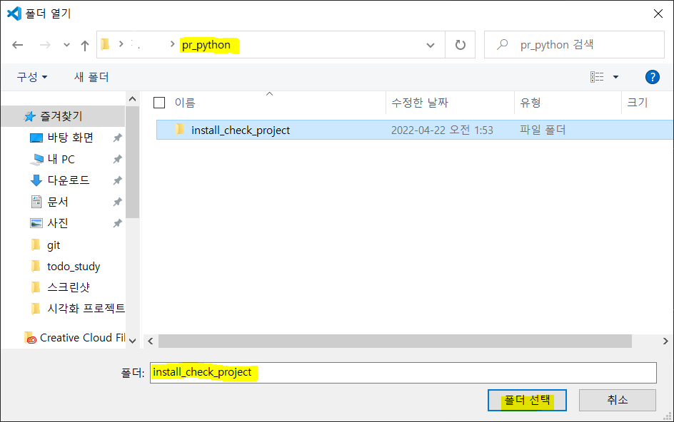
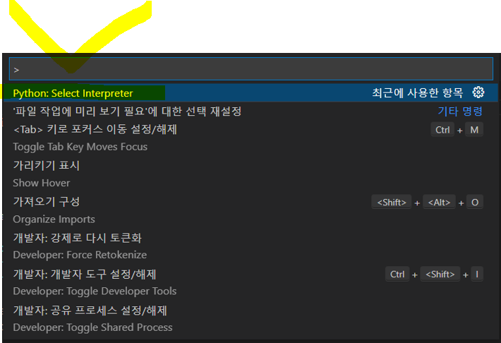
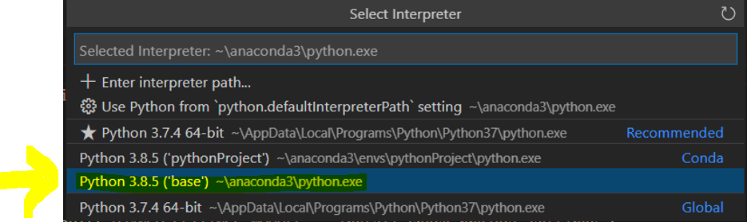
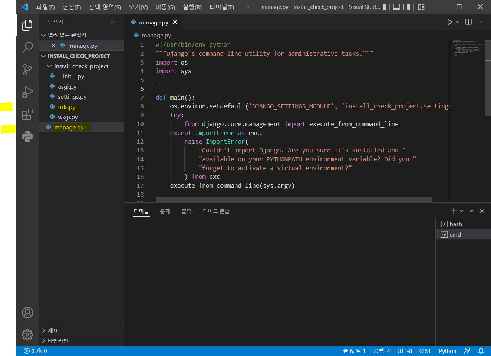
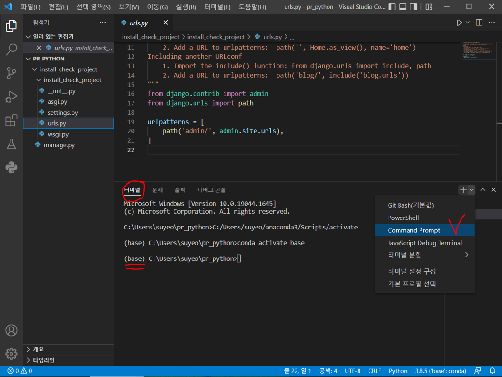
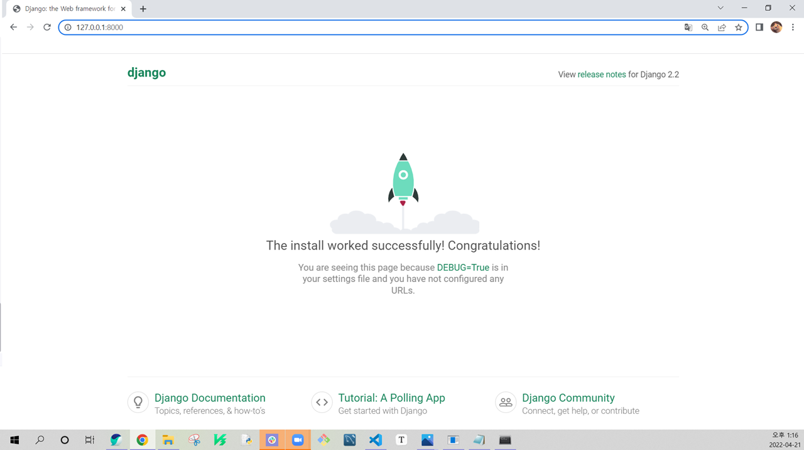
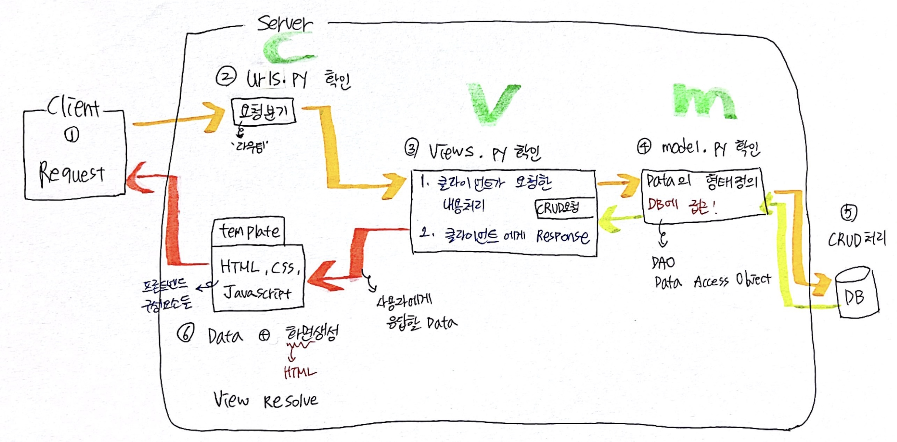

# Django 란?

- 장고는 파이썬 언어를 기반으로 한 **웹 프레임워크**

  - 프레임워크 : `경기장` (이렇게 해라~ 라는 가이드 라인이 제시되어있음.)
  - 처음엔 이해보단 외워야된다.
  - 여기선 반드시 뭘 써야되고 여기선 뭘 써야되고~ 이런 사항들을 다 외우면서 사용하다가 나중에 이해를 하는것을 목적으로 두고 사용하면 된다.
  - 웹개발[^1]

  

- 장고는 웹 애플리케이션에서 전통적인 **MVC 패턴**을 따른다.

  - 이 `MVC 패턴`이라는 것이 아주 중요함.
  - MVC 패턴은 Django 만의 패턴이 아니고 거의 모든 **웹개발의 기초가 되는 패턴**이라고 생각하면 된다.
  - 장고가 MVC패턴을 따른다는말은 **코드가 MVC 라는 패턴으로 짜여져 있다**는것 
  - 코드를 작성하는 패턴을 **디자인 패턴**[^2] 이라함.


+ 우리가 웹 애플리케이션을 개발한다고 하면 기본적으로 다들 사용하는게 있는데 바로 로그인 기능, 게시판 기능, 사이트 관리자 페이지 등등

  

  근데 장고는? **관리자 페이지 같은 기능을 미리 만들어서 제공을 해준다**

  + 장점이자 단점

  

+ 장고는 너무 데이터에 집중을 한 나머지 **프레임워크가 데이터 친화적이다.**
  + 번외)다른 프레임워크들 컨셉도 잠깐 얘기해보자면
    + Node.js 는 미들웨어 중심(사용자의 요청을 잘 받고 잘 처리하기위한 미들웨어에 집중)
    + Spring 은 애플리케이션 개발 자체에 집중


+ 수업시간에 장고 책 설명부분중 

  ```markdown
  `다양하고 강력한 기능들을 익히기위한 초기장벽은 낮지않은편이다.`
  ```

  라고 되어 있는데 그 이유는 장고가 너무 사용하기가 쉬운 툴이여서 깊은 부분을 이해하는데 시간이 더 들어갈수있다 라는 의미. 


# Django로 서비스 개발해보기


## Django 설치해보기 & 간단한 test

> 책 기준으로 설치 진행해볼꺼여서 버전넘버[^3] 2.2.1 인 옛날 버전으로 설치+테스트 해본후 지울꺼임.


### Django 설치 후 폴더 생성

1. 일단은 `Anaconda Prompt` 를 열어준다. 여기서 진행할꺼임.

prompt 열어주면

```powershell
(base) C:\Users\suyeo>
```

 이렇게 뜨는 상태 일것이다.


2. `pip install django==2.2.1`  

(`pip install django` 만 쓰면 알아서 최신버전으로 다운됨.)

```powershell
(base) C:\Users\suyeo>pip install django==2.2.1
```

이렇게 단순하게 설치를 하게되면 2개의 패키지가 같이 설치가되는데 하나는 `sqlparse` 이고, 또 다른 하나는 `Django` 패키지가 설치된다. 

+ `sqlparse`  패키지 : 장고는 데이터 친화적인 웹 프레임워크라서 `orm` 을 나중에 쓸수있게끔 같이 설치시켜주는 패키지 라고 보면 된다.


번외) 잘 설치됬나 확인해보면

```powershell
(base) C:\Users\suyeo>python -m django --version
```

출력

```powershell
2.2.1
```


3. 이제 작업폴더로 들어가 보자

```powershell
# 새로운 작업폴더를 만들어서 쓰고싶은경우 -> 'mkdir' 을 사용해서 새로운 디렉토리를 만들어준다~
(base) C:\Users\suyeo>mkdir pr_python
```

```powershell
# cd 명령어 이용해서 디렉토리 위치 변경
(base) C:\Users\suyeo>cd pr_python
```

```powershell
# 작업폴더로 들어오면 
(base) C:\Users\suyeo\pr_python>
```

```powershell
# 'scrapy'에서 했던것과 비슷하게 'startproject' 명령어를 사용해서 장고를 시작해주면됨.
(base) C:\Users\suyeo\pr_python>django-admin startproject install_check_project
```


### VSCode 로 넘어와서 'install_check_project' 폴더를 살펴보자

4. **VSCode로 와서 ''폴더열기'' 해주는데 'install_check_project' 폴더를 열어주면된다**




5. 폴더를 열면 Python: Select Interpreter 로  들어가서 가상환경 선택을 해준다 (`F1` 키 이용)

+ 강의시간엔 anaconda3로 선택해서 사용했다. 







6. 일단 다른건 볼 필요없고 `manage.py` 랑 `urls.py` 만 살펴볼거다.




+ `settings.py` : 데이터베이스 설정이나 또는 어플리케이션 이라는걸 추가해줄때 그것들에 대한 정보가  `settings.py` 에 기록이 된다.


+ `manage.py` : manage.py 를 열어보면 어떤 코드들이 이미 적혀있다. 우리가 manage.py 에 뭔가를 작성할 일은 없을거다. 근데 이 manage.py가 굉장히 중요한 파일이다. 이 파일을 기점으로 웹서비스가 시작되기때문. 그렇기때문에 manage.py 파일을 함부로 수정하거나 건들지 말아야한다. (진짜 필요한 경우에만 수정해준다.) 

​	   manage.py 의 역할 : 장고 웹서버를 시작시켜주는 역할을 해준다.[^4]


+ `urls.py` : url 이라는걸  다른말로 `Router(라우터)` 라고도 함. urls.py는 라우터에 관련된 것들을 적어주는 곳이다. 웹서비스를 개발을 할때 사용자들의 요청을 받기위해 url 을 사용하는데 이 url 을 이용해서 어떠한 요청을 받을것인가.. 등등 의 내용을 적어놓은게 바로 urls.py 라고 보면된다. 

```python
# urls.py 의 'urlpatterns' 에 url과 사용할 서비스들이 다 들어가있다.
# urls.py 가 옛날에 강사님이 웹서비스 처음 설명해주셨을때 '메뉴판' 이라고 비유해서 말해주신 그거다. 서버 입장에서 클라이언트들의 요청을 받기위해서 메뉴판을 마련을 해야되는데 그 메뉴판을 작성하는곳이 바로 'urls.py' 인것.

urlpatterns = [
    path('admin/', admin.site.urls),
]
```


### 이제 서버를 실행해보자!

7. 터미널을 열어준다. (`ctrl + 백틱`)




`Command Prompt` 를 클릭해 `Anaconda Prompt` 가 열리도록 해준다


8. 터미널에 명령어 `python manage.py runserver`을 쳐준다.

```powershell
(base) C:\Users\suyeo\pr_python\install_check_project>python manage.py runserver
```

출력

```powershell
Watching for file changes with StatReloader
Performing system checks...

System check identified no issues (0 silenced).
April 22, 2022 - 02:55:59
Django version 2.2.1, using settings 'install_check_project.settings'
Starting development server at http://127.0.0.1:8000/
Quit the server with CTRL-BREAK.
| -> 여기서 마우스 커서 깜빡깜빡 하고 있음. ctrl + c 누르면 서버 종료됨.
```


+ 서버에 요청을 할때는 2가지 요소가 필요한데, 첫번째로는 컴퓨터의 위치주소가 필요하고 두번째로는 뭘 요청을 할건지를 말해줘야한다. 
  + ip주소 또는 도메인 + url (뭐를 요청할껀지 추가적인 사항들)
  + ip주소는 인터넷을 사용하는 환경에서의 컴퓨터의 위치주소를 말함.

+ `http://127.0.0.1:8000/ ` 에서 `127.0.0.1` 은 내 컴퓨터 주소다. 
  + 그래서 `localhost`(로컬호스트) 라고도 함.
  + 📌<u>`http://127.0.0.1:8000/` = `http://localhost:8000/`  이렇게 로컬호스트 라고 쳐도 된다!</u>
  + 나중에 **aws** 같은 다른걸 이용할때는(**서버호스팅**을 할때는) 이 주소가 바뀐다.
+ `http://127.0.0.1:8000/ `  여기서 뒤쪽의 `8000`은 포트가 된다.
  + 우리가 만든 장고는 포트번호 `8000`의 포트를 쓴다는것.
  + 번외) 서비스 마다 각각 고유의 포트번호를 가진다. (포트번호는 겹치면 안된다.)
  + MySQL 은 포트번호 3306 를 사용
  + MongoDB 는 포트번호 27017 를 사용
+ 결론적으로 `http://127.0.0.1:8000/ `  의 의미는 내 컴퓨터에서 이 서버가 구동된다~ 라고 생각하면됨.


9. `http://127.0.0.1:8000/` 서버를 클릭해준다. (`ctrl + 클릭`)

서버를 클릭해주면 이런 창이 하나 뜬다.




# MVC 패턴





## Vscode의 터미널에서 진행

+ `python manage.py migrate` : 마이그레이트 진행

```powershell
(base) C:\Users\suyeo\mc_python\mc_django01>python manage.py migrate
```

출력

```powershell
Operations to perform:
  Apply all migrations: admin, auth, contenttypes, sessions
Running migrations:
  Applying contenttypes.0001_initial... OK
  Applying auth.0001_initial... OK
  Applying admin.0001_initial... OK
  Applying admin.0002_logentry_remove_auto_add... OK
  Applying admin.0003_logentry_add_action_flag_choices... OK
  Applying contenttypes.0002_remove_content_type_name... OK
  Applying auth.0002_alter_permission_name_max_length... OK
  Applying auth.0003_alter_user_email_max_length... OK
  Applying auth.0004_alter_user_username_opts... OK
  Applying auth.0005_alter_user_last_login_null... OK
  Applying auth.0006_require_contenttypes_0002... OK
  Applying auth.0007_alter_validators_add_error_messages... OK
  Applying auth.0008_alter_user_username_max_length... OK
  Applying auth.0009_alter_user_last_name_max_length... OK
  Applying auth.0010_alter_group_name_max_length... OK
  Applying auth.0011_update_proxy_permissions... OK
  Applying sessions.0001_initial... OK
```


+ `python manage.py createsuperuser` : 관리자 계정생성

```powershell
(base) C:\Users\suyeo\mc_python\mc_django01>python manage.py createsuperuser
```

출력

```powershell
Username (leave blank to use 'suyeo'): admin_suyeo #아무 이름이나 설정해준다
Email address: suyeee@gmail.com #아무 계정이나 설정 가능
Password:            #비번을 입력해주면되는데 4자리로 설정해줬다.
Password (again):
This password is too short. It must contain at least 8 characters.
This password is too common.
This password is entirely numeric.        
Bypass password validation and create user anyway? [y/N]: y # 비번이 너무 짧다고 진짜 이걸로 할꺼냐고 물어보는거.
Superuser created successfully.
```


+ `python manage.py startapp [  ]`

```powershell
(base) C:\Users\suyeo\mc_python\mc_django01>python manage.py startapp blog  
```

```powershell
(base) C:\Users\suyeo\mc_python\mc_django01>python manage.py startapp single_pages
```

출력은 아무것도 안뜨는게 정상.


+ `python manage.py makemigrations` : 마이그레이션 만들어주기 (안만들면 마이그레이면 안됨.)

```powershell
(base) C:\Users\suyeo\mc_python\mc_django01>python manage.py makemigrations
```

출력

잘못된 출력

```powershell
No changes detected  # Vscode 에서 파일 000 의 저장버튼을 안눌러서 그럼.
```

올바른 출력

```powershell
Migrations for 'blog':
  blog\migrations\0001_initial.py

   - Create model Post
```


+ python manage.py migrate : 다시 마이그레이션 반영시키기

```powershell
(base) C:\Users\suyeo\mc_python\mc_django01>python manage.py migrate 
```

출력

```powershell
Operations to perform:
  Apply all migrations: admin, auth, blog, contenttypes, sessions
Running migrations:
  Applying blog.0001_initial... OK
```


<마이그레이션 했으니 서버 끄기>
아나콘다 프롬포트에서 ctrl + c 눌러서 서버 종료

python manage.py runserver : 다시 서버 실행. 마이그레이션 할땐 서버 껏다 다시 켜야됨.

blog 폴더에 admin.py 에 모델 등록시키기


****

- Vscode의 `Extension Pack` 을 다른걸로 설치하고 싶으면 구글링해서 찾아보면 여러 추천글이 나온다.
- Vscode 초기 셋팅 
  - 왼쪽의 Extensions(확장) 탭에서 python 검색 후 아래의 `3가지` 항목 설치
  - `python`
  - `python for VSCode`
  - `python Extension Pack`
- Vscode 터미널 셋팅
  - `Command Prompt` 를 클릭해 `Anaconda Prompt` 로 열리도록 설정


****

*****

[^1]:웹 개발은 프론트엔드와 백엔드가 있는데 그중 백엔드를 개발할수있는 언어는 매우 다양함. ex) Python, JavaScript, Java, Spring, Go, C++ ,C#... 등등. 여기서 백엔드란 우리가 소위 말하는 웹 서버다. 결론적으로 보자면 백엔드는 사용자의 요청을 처리하는 부분이라는것. 다만 이 사용자 요청처리라는것이 눈에 보이지는 않는다.  이와 반대로 사용자의 눈에 예쁘게 보여줘야하는것은 프론트엔드이다. 프론트엔드에 사용되는 언어는 HTML, CSS, JavaScript 이렇게 3가지 밖에 없다. TypeScript 도 있긴한데 JavaScript의 업그레이드 버전 정도로 생각하면 된다. 
[^2]:디자인 패턴에는 MVC 패턴만 존재하는게 아니라 아주 다양한 패턴이 존재함.
[^3]: 번외) 버전 넘버에 대한 설명. 장고 버전넘버로 설명해보면 2.2.1 에서 맨앞의 '2'는 완전 새로운 업데이트가 됬을시 숫자가 높아지고, 가운데 '2'는 이 버전 내에서 메이져급 기능들이 수정이 되거나 추가가 되거나 등등 메이져급들 업뎃 됬을떄 숫자가 높아진다. 마지막 '1'은 소소한 오류를 잡거나 했을때 숫자가 올라간다. 
[^4]: 웹서비스가 시작된 상태에서 나머지들을 관리해야하기때문에 manage.py 가 정말 중요하다.