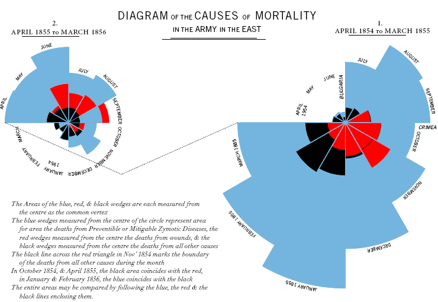

# 1차시: 빅데이터 시대의 현재와 미래

+ 세계최대의 물류기업인 `ups` 는 220여개 나라에서 약 800만 고객을 위해 하루 1,500 만개의 소포를 배달
  + 다양한 화물의 선적, 이동경로, 운행상황의 **실시간 모니터링 및 통제**
  + `UPS`의 운행통제 시스템은 **빅데이터를 자동분석**하여 화물의 수거와 배달을 위한 **최적노선을 실시간으로 통제**하여 하루에 한 차량 당 약 1.6Km 의 주행거리를 단축할수있고, 연간 1,100 만 리터의 **연료** 및 약 600억원의 **비용을 절약** 하고있다.

## 빅데이터

> 기존의 IT 기술로 처리하기 어려운 데이터

## 빅데이터의 활용

+ 정보를 담고있는 데이터에서 통찰력(`insight`)을 추출할수있는 능력이 필요하다.
+ 데이터를 전략적으로 바라볼수있는 시각이 필요하다는것
+ 모든 데이터를 분석 할 필요는 없고 나에게 필요한 데이터만 분석한다.
+ 데이터를 잘 활용하면 기업의 경쟁력을 확보하기에 유리하므로 중요하다.
+ 기업은 데이터를 어떤일이 왜 발생했는지를 분석하는데 활용한다.
  + 데이터 분석을 바탕으로 앞으로 일어날 일을 예측하고 대비한다.
  + 예측에는 기계학습(`Machine Learning`) . 즉, 인공지능을 활용한다.

## 인공지능이 기계학습을 한다?

+ 기계학습이란
  + 명시적으로 프로그래밍을 하지않고도 **컴퓨터가 데이터 속에서 학습**하는 능력

+ 스팸필터를 예시로 들어보면, 메일함에 발송되는 스팸메일들을 거르기위해선 약 10,000 개 정도의 단어가 필요하다. 하지만 이걸 프로그래밍으로 짜기에는 양이 너무 많다..... 어떻게 하지???
  + 기계학습을 이용하자!!
  + 컴퓨터 알고리즘이 **스스로 학습하여 스팸을 구분**할수있는 능력을 갖게된다.

+ 알고리즘 : 데이터 분석 -> 패턴분석 -> 학습 -> 문제해결

+ 인공지능은 언어지능, 시각지능, 공간지능, 감성지능, 요약/창작 5대영역에서 미리 정의된 특정한 형태의 문제를 푸는것인데
  + 이같은 인공지능은 학습을 위하여 많은 양의 데이터, 그리고 이를 처리할수있는 기술이 필요하다.
  + 엄청난 양의 다양한 데이터가 폭주하고 있는, 그리고 또 클라우드 서비스와 오픈소스 소프트웨어가 쉽게 접근가능한 빅데이터 시대에 이르러 **인공지능과 빅데이터**는 찰떡궁합으로 **높은 성과**를 내고있다.

## 빅데이터, 인공지능, 4차 산업혁명 공통점

+ 가장 큰 공통점은  데이터에 바탕을 두고(Data-driven), 사실에 근거한 (Fact_based) 의사결정이 뿌리깊게 내려지고 있다는것.
+ 보통 데이터를 활용하는 측면에서 의사결정 유형을
  + **데이터 거부** : 데이터를 불신하고 사용을 회피함.
  + **데이터 무관심** : 데이터에 무관심하며, 활용의사없음.
  + **데이터 편식** : 자신의 의사결정을 지지하는 경우에만 데이터를 활용함.
  + **데이터 기반** :  모든 의사결정의 근거로 **데이터를 적극적으로 활용**함.
+ 이 중 데이터 기반 의사결정은 데이터를 모든 의사결정에 근거로 적극적으로 활용하는 유형으로, 빅데이터 시대에 장기적으로 높은 성과를 낼수있다.

## 빅데이터 시대의 기업

+ 빅데이터 시대에 기업의 **경쟁우위 달성수단**은 **데이터 분석**

  + 기업 내, 외부에서 데이터가 넘쳐나는 이 시대에 **데이터 분석**을 통해 고객과 시장에 대한 **인사이트를 추출**하고 **그것을 바탕으로 현명한 의사결정을 할때만**이 지속 가능한 경쟁우위를 창출할수있게된다.
  + 더욱이 저성장 속에서 경쟁이 더욱 격화되고있는 현시점에서는 경험이나 감이 아니라 데이터 분석에 근거하여 의사결정을 하는것은 매우 중요하다. 이제 데이터 분석에 근거하지않는 의사결정은 결정내릴 가치조차 없다.

  

+ 기업 경쟁력의 3가지 원천

  1. 남들보다 낮은 비용

  2. 무관심한 틈새시장

  3. 모방이 힘든 차별성

  + 위의  3가지 원천중 1,2 번의 경우 시장과 고객에 대한 데이터의 정밀한 분석에서 나오는 통찰력에서 찾을수있다.
  + 남과 다른 차별성 역시 남들이 쉽게 따라할수없는 데이터 분석의 경험과 기계학습 알고리즘에서 나오는 것이다.

+ 미래의 불확실성이 높고 의사결정이 초래하는 파급효과가 클수록 실제 데이터의 분석에서 통찰력을 추출하여 이를 의사결정에 잘 활용하는것이 필수.

+ 기업 내에서 **데이터 분석**을 통한 **현명한 의사결정**은 어떻게 하는가?

  + 우선 **문제를 제대로 인식**하고 그것이 왜 어떻게 일어나는지를 **제대로 판단** 할수있어야 한다.

  + 데이터 분석에 근거하여 경쟁하는 기업들은

    + 어떻게 ,왜 일어났는지

    + 최선의 대응은 무엇이며

    + 최선의 상황을 유도하기위한 조치는 무엇인지

    + 위 와 같은 근본적인 질문들에 대해 정규한 분석기법을 활용하여 답을 구한다

      + 여기서 인공지능의 핵심인 **통계** 혹은 **기계학습 모델**이 활용된다.

      + 이 과정에서 찾아낸 **최종모델**은 현재 무슨일이 벌어지고 있는지. 즉, **이상징후를 미리 탐지**해서 즉각 **실시간으로 대응**하는데 사용된다.
      + 또한, 최종 모델로 미래상황을 **예측**하여 자신이 원하는 최선의 상황을 유도하기위해 필요한 조치인 **개인추천/ 최적화** 도 하게된다.

+ 이제 기업은 빅데이터 시대에 효과적으로 적응하기 위해서 **어떻게 변화 할것인가**를 심각하게 고민해야한다.

## 기업이 어떻게 적극적으로 대응해야 하는가?

1. **디지타이닝 비즈니스**(`Digitzing Business`)로 혁신

+ 사업 전반을 디지털로 혁신하는것.
+ 디지타이닝 비즈니스는 사업을 혁신하는 도구로 빅데이터 시대의 5대 핵심기술을 활용하는것이다.
  + 빅데이터 시대의 5대 핵심기술
    + 소셜
    + 모바일
    + 사물인터넷
    + 클라우드
    + 인공지능

2. **분석지향 리더십**으로 무장

+ 감으로 하는것이 아니라 데이터. 즉, 사실에 근거해서 의사결정을 해야한다는것

3. **데이터에 근거한(Data-driven)** 의사결정을 **일상화**할수있는 **기업문화 조성**

+ 분석지향 리더십의 주도하에 기업 내의 전 구성원이 기업문화 조성
+ 구글 애플 아마존 등등 **글로벌 기업**들은 **데이터 분석적 경영**으로 경쟁력을 갖추고 **분석지향적 조직문화**를 구축하고있다.

# 2차시: 분석, 빅데이터 시대 필수역량

+ 지금으로부터 549년전인 1465년 6월의 어느날
  + 세종대왕이 신하들에게 "한양의 위도가 얼마인가?" 라고 물었으나 신하들이 대답도 못하고 우물쭈물하고 했다.
  + 그때 한 신하가 "한양의 위도는 38도 강(强)이옵니다." 라고 답하였는데, 이 신하의 이름은 이순지(李純之) 다.
  + 이후, 이순지는 세종대왕의 눈에 들어 세종대왕을 도와 조선의 **천문역법**을 만들었다.
  + 그렇다면 이순지가 세종의 눈에 들어 발탁될수있었던 이유는 무엇일까?
    + 우리만의 역법을 세우려는 임금의 뜻을 헤아리고 역법의 가장 기본이 되는 한양의 위도를 미리 분석했다. 그렇기에 갑작스런 세종의 질문에 답을 할수있었다.

## 문제인식과 관련 연구조사

+ 빅데이터 시대에 갖추어야 할 **필수역량**이 바로 숫자와 통계를 기반으로 하는 **분석능력**이다.
  + 데이터가 넘쳐날수록 문제를 해결하기위해선 관련자료를 수집하고 분석해서 **필요한 정보**를 **추출**할수있는 능력이 필요하고 매우 중요하다.
  + 효율적인 의사결정은 이러한 계량적인  정보를 얼마나 능숙하게 다루느냐에 달려있기때문에

+ 분석이란?

  1. 연구목적
  2. 연구설계
  3. 표본설계
  4. 자료수집
  5. 자료분석
  6. 결과제시

  + 총 6단계의 과정으로 진행되는것을 말한다.

+ 분석은 자신이 하고있는 업무나 관심을 갖고있는 현상에서 **문제를 인식**하고 그것을 **해결**하려는것에서 부터 시작된다.

  + 이것을 **문제인식** 단계라고 한다.
  + 이 문제들이 분석의 주제가 된다.
  + 그래서 문제인식 단계에서는 문제가 무엇인지 파악하고, 왜 이문제를 해결해야하는지, 문제해결을 통해 무엇을 달성할것인지(목표)를 명확히 하는것이 중요하다.

  

+ 문제와 **직.간접적으로 관련된 지식**을 각종 문헌을 통해 **조사**
  + **관련 연구 조사** 단계
  + 문제인식의 다음단계
  + 이 단계에서 우리는 문제와 관련된 주요 변수들을 파악할수있게된다.
  + **변수**란?
    + 사람, 상황, 행위 등의 속성을 나타낼수있는 대응물(proxy) 
    + 예를들면. 지능지수, 나이, 시험성적 등등
  + 관련연구조사 단계에서 관련자료들을 모두 섭렵하는것은 분석에서 가장 중요한 부분이며, 다음단계의 모형화나 변수선정을 위해 필수적이다.

+ 나이팅게일

  + 1854년 , 크림전쟁의 참상이 자극이 되어 야전병원에 간 나이팅게일은 이 병원의 환자사망률이 무려 43%에 달하는 이유를 밝히고자 했다.
  + 참고자료가 없어 스스로 기록을 해 자료를 만들었다.
    + 누가, 어떤 질병에 의해 죽었는지 등을 기록하였다.
  + 결국은 부상보다 다른질병감염이 사망의 주요 원인이였던것으로 밝혀졌다.

  

## 모형화와 자료수집

+ 자료들을 찾고있었다면 문제와 관련된 내용을 정리해 관련변수를 뽑아내야한다. 만약 자신의 문제와 유사한 연구를 찾았다면 그 연구결과를 그대로 적용할지 아니면 최소한 같은 방법을 쓸지 검토해야한다.

  

+ 변수 재구성시 어떠한 변수를 버리고 어떠한 변수를 선택할것인가의 변수선정 기준은
  + 그 변수가 문제해결에 **직접적인 관련**이 있는지를 확인하면된다.

+ 모형화로 인해 변수가 선정됐다면 그 변수들을 측정해야한다
  + 이 단계를 **자료수집(변수측정)** 단계라고한다.
  + 이때 자료(Data)는  변수들의 측정치를 모은것
    + 인식된 문제는 모형화를 통해 주요변수로 재구성되고 측정이라는 과정을 거치면서 자료가 된다.
    + 그래서 이 단계를 자료수집 단계 라고도 하는것

## 자료분석과 결과제시

+ 나열된 숫자에서 변수간에 규칙적인 패턴, 변수 간 관련성을 파악하는 자료분석이 필요하다.
  + 나이팅게일의 경우 위생상태를 기록하진 않았으나 위생에 신경을 계속 쓰고있었는데, 월별로 사망원인별 사망자수를 표로 요약했더니 위생개선에 따른 원인별 사망률의 감소를 확인할수있었다.

+ 나이팅게일은 결과제시를 위해 고민하다가 

  

  위 사진과 같이 파이형태의 그림을 그렸다.

  

  + 나이팅게일은 문제에 대해 자료를 수집하고 표와 그래프로 만들어(자료 만들기) 그 의미를 해석(자료해석)함으로써 문제를 해결했다.

+ 문제 분석도 중요하지만 결과를 어떤 방식으로 제시하는지도 중요하다.
  + 성공적인 의사결정을 하는데에 있어서 가장 중요한것이 바로 **자료**이기때문이다.
  + 그렇기 때문에 다양한 **차트**나 **그래프**를 활용하여 결과제시를 하는것이 좋다.

> 분석의 6단계
>
> **문제인식 -> 관련연구조사 -> 모형화(변수선정) -> 자료수집 -> 자료분석 -> 결과제시**

# 3차시: 평균의 함정

+ 1994년, 선수들의 파업으로 월드시리즈도 취소되는 등 미 프로야구 사상 가장 긴(8개월) 구단주와 선수노조 사이의 싸움으로 야구팬들의 비난을 받았던사건이 있었다.
  + 구단주와 노조는 파업기간중에 여론을 자신들에게 유리한 방향으로 이끌기 위해 열띤 홍보전을 펼쳤다.
  + 구단주들은 평균연봉이 13억원(120만 달러)이나 되는 선수들이 파업을 한다며 엄청난 소득을 올리는 선수들이 돈 욕심을 부리는것이라고 비난을 유도했고
    + 당시 여론조사 결과, 응답자의 43%가 구단주를 지지했고 응답자의 22%가 선수들을 지지했다.
  + 결국, 노조와 구단주의 힘겨루기는 구단주의 완승으로 끝났다.
  + 만약 노조측에서 구단주가 산술평균을 사용한 사실을 눈치챘다면 구단주의 작전에 반격할 방법을 쉽게 생각해 냈을지도 모른다.
    + 산술평균의 경우 연봉의 최빈수가 30만 달러, 중앙값이 40만 달러, 평균이 120만 달러로 나왔다. 30만 달러의 연봉을 받는 선수들의 인원이 훨씬 많았다.
    + 합당한 대표값을 사용하라고 한다던지, 대부분의 선수들이 평균 40만 달러의 연봉을 받는다고 홍보하던지

## 평균의 종류

+ 우리가 소위 말하는 평균은 산술평균이다.
  + 산술평균
    + 모든 자료의 값을 다 더해서 전체수로 나눈것
    + 예시1)
      + 1+1+2+3+1+3+4 = 15 , 15 / 7 = 2.1 (대표값)
      + **대표값**은 평균이 전체 숫자의 중심을 나타내는것
    + 예시2)
      + 1+1+2+3+1+3+`17` =28 , 28 /7 =4 (대표값 역할못함)
      + 1,2,3 의 숫자들이 대부분인곳에 17 이라는 숫자가 들어와 같이 평균을 구하게 되면 그 평균은 전체숫자의 중심을 나타내는 대푯값의 역할을 하지 못하게 된다.
      + 이런 경우엔, 상대적으로 큰 값에 영향을 받지않는 **중심의 측정치**를 **중앙값과 최빈수를 중심**으로 볼수있다.
        + **중앙값**이란?
          + 숫자들을 크기의 순서로 배열했을때, 정가운데에 위치하는 값
          + 예시1과 예시2의 중앙값은 둘다 `2` 이다.
        + **최빈수**란?
          + 가장 흔하게 나타나는 수
          + 예시1과 예시2의 최빈수는 `1` 이다
          + 그래서 예시2 에서 최빈수를 사용한 평균은 `1` 이 되며, 중심의 **대표값 역할**을 할수있게된다.

## 어떤 평균을 써야하는가?

+ 우리가 자주 사용하는 영어성적, 키, 몸무게 ..같은 수치들은 대부분 좌우대칭의 종모양으로 데이터가 분포되어있다.

  + 종모양 분포

  + 이런 경우엔 평균, 중앙값, 치빈수가 다 일치하므로 어느 평균을 사용할지 고민안해도된다.

+ 종모양 분포를 이루지 못하는 경우?
  + 종모양의 분포를 하지않는 경우에는 평균이 어떤 종류의 평균인지 알기전에는 의미가 없다.
  + 대표적인것이 소득분포 
    + 오른쪽 꼬리분포의 모양을 가진다. (오른쪽 꼬리가 긴 분포 )
    + 소수의 인원이 높은 소득을 받으므로

+ 평균값이 다른경우 무엇을 사용해야하는가?
  + 각각의 특징에 어울리게 사용한다.
  + **값들이 어떤 범위 내 유사한 경우**
    + 산술평균 사용
  + **특정한 값을 선택하는 경우**
    + 중앙값이나 **최빈수** 사용
  + 예시)
    + 어떤 음식을 좋아하는지에 관해 설문을 할때 1. 한식, 2. 중식.. 이런식으로 되어있다면
    + 산술평균으로 평균을 구하면 의미가 없는 숫자인 2.5 이런식으로 평균이 구해질수도 있다.
    + 이때는 가장 많은 수의 사람들이 선택한 번호, **최빈수**가 중심의 **대표값**이 된다.

+ 주의할점

  1. 데이터 분포를 반드시 고려해야한다.

     + 종모양 분포가 아닌경우 산술평균이 대표값으로서 의미가 약해진다.
     + 표본에 따라 평균값이 크게 변화 하지않는것을 선택해야한다.
       + 포본에 따라 다르겠지만 최빈수가 제일 안전한 선택이다.

  2. 평균을 사용하려는 목적에 맞추어 결정해야 한다.

     + 사용목적이 달라지면 사용해야할 평균이 달라질수있기에

  3. 선택한 평균으로부터 유도된 결론이 데이터에 잘못된 인상을 주지 않는지 고려해야한다.

     

****

### 용도에 맞게 정리해보면

+ **명명척도로 측정한 경우**
  + 최빈수 사용
+ **서열척도인 경우**
  + 중앙값 사용
+ **이외의 경우**에는 **3가지 평균** (산술평균, 최빈수,중앙값) 모두 다 사용가능

****

## 흩어져 있는 정도

+ 흩어져 있는 정도는 무엇?

  + 데이터가 얼마나 퍼져있느냐를 말한다.
  + 즉, 각각의 숫자들이 **얼마나 서로 다른가**를 말한다.

  + 흩어져 있는 정도를 나타내는 가장 간단한 측정치는 **범위**
    + **범위(Range)** : 최솟값과 최댓값과의 차이
  + 흩어진 정도를 나타내는 측정치로 가장 널리 사용하는건 **표준편차**
    + **표준편차의 값이 클수록** 산술평균을 중심으로 **많이 흩어져있다.**

+ 결론
  + 평균값과 표준편차를 함께 고려해야함
  + 표준편차가 큰 경우, **평균은 중심의 대표값으로서의 의미가 약함**

## 가중 평균의 함정 : 심프슨의 역설

> **심프슨의 역설**
>
> **동일하지 않은 가중치를 적용함에 따라 부분에 대한 분석결과와 전체에 대한 분석결과가 일치하지 않는 현상**

# 4차시: 퍼센트를 조심하라

