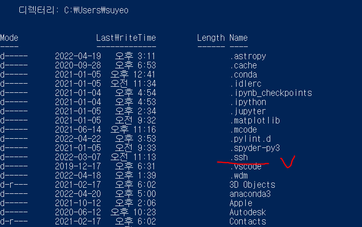
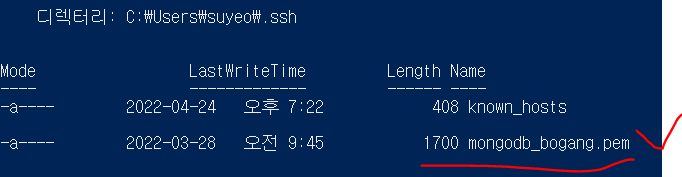
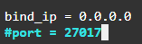
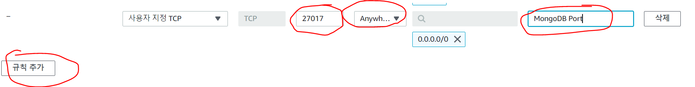
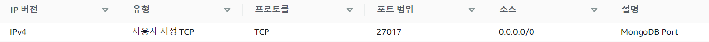
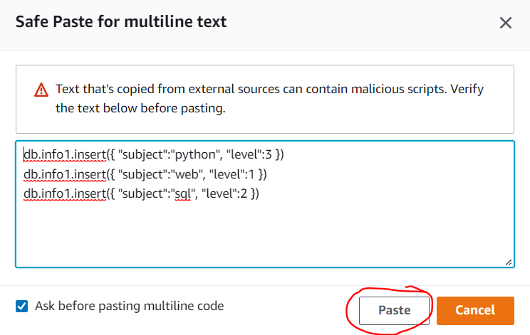
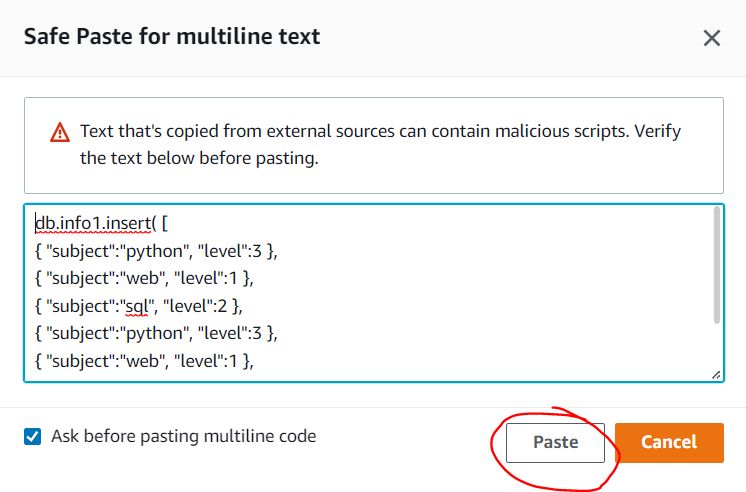
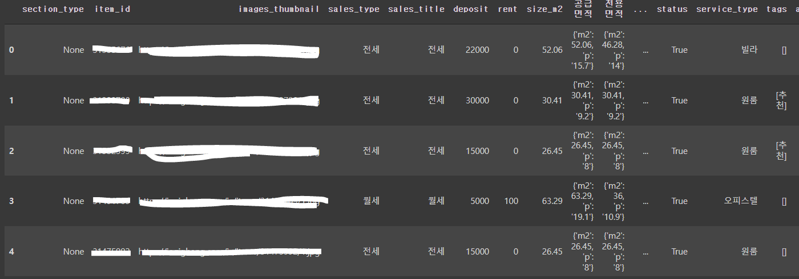
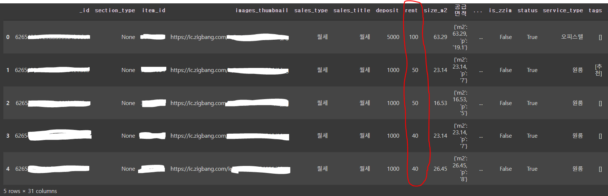

# 초기셋팅

> AWS 접속후 인스턴스 시작 누르기
>
> 인스턴스 없으면 새로 만들기


## PowerShell 버전


**powershell 열어서 ssh 폴더 있눈지 확인하고 없으면 ssh 폴더 생성(`mkdir .ssh`)**

```powershell
PS C:\Users\suyeo> dir
```

화면 출력



ssh 폴더 있는지 확인


**pem 파일 찾아서 ssh 폴더로 옮기기**

```powershell
PS C:\Users\suyeo> mv .\Downloads\mc_mysql.pem .\.ssh\mongodb_bogang.pem
```

mv .\Downloads\mc_mysql.pem .ssh 누르고 `tab키` 누르면 자동으로 앞뒤에 \ \ 붙음.


**ssh 폴더로 이동**

```powershell
PS C:\Users\suyeo> cd .ssh
```


**AWS 연결 (SSH 클라이언트 탭에 맨밑에꺼 복사)**

```powershell
PS C:\Users\suyeo\.ssh> ssh -i "mc_mysql.pem" ubuntu@ec2-00-00-000-000.ap-northeast-2.compute.amazonaws.com
```


**ssh 폴더에 pem 파일 있는지 확인**

```powershell
PS C:\Users\suyeo\.ssh> dir
```

화면 출력




근데 우분투 연결 안됨... AWS 의 CloudShell 로 들어가서 작업!!

****


## CloudShell 버전


+ **aws 의 `cloudshell` 로 들어가서 pem 파일 업로드 후에**

```powershell
[cloudshell-user@ip-00-0-000-000 ~]$ chmod 400 mongodb_bogang.pem
```


+ **ssh 클라이언트 주소 복사해서 연결**

```powershell
[cloudshell-user@ip-00-0-000-000 ~]$ ssh -i "mc_mysql.pem" ubuntu@ec2-00-00-000-000.ap-northeast-2.compute.amazonaws.com
```


이제 이렇게 우분투 뜨면 연결된것.

```powershell
ubuntu@ip-000-00-00-000:~$
```


+ **최신버전으로 업뎃**

```powershell
ubuntu@ip-000-00-00-000:~$ sudo apt update -y
```

```powershell
ubuntu@ip-000-00-00-000:~$ sudo apt upgrade -y
```


- **MongoDB 설치**

```powershell
ubuntu@ip-000-00-00-000:~$ sudo apt install -y mongodb
```

-y 를 치면 중간에 yes/no 묻는 질문들 자동으로 yes 로 처리됨.


- **MongoDB가 잘 작동중인지 확인해보기**

```powershell
ubuntu@ip-000-00-00-000:~$ sudo systemctl status mongodb
```

출력 화면

```powershell

   Active: active (running) since Sun 2022-04-24 10:56:46 UTC; 1min 57s ago

```

active (running) 떠있으면 됨.


+ **MongoDB 설정 파일 수정**

```powershell
ubuntu@ip-000-00-00-000:~$ sudo vi /etc/mongodb.conf
```

`i 키 `눌러서 `insert 모드`로 들어가서



`bind_ip` 를 `0.0.0.0` 으로 수정 -> 이제 어디에서든 MongoDB에 접속이 가능해졌음.

`esc 키` 누르면 `insert 모드` 종료됨. 

그후 `:wq` 누르면 저장 후 종료됨.


- **MongoDB 설정이 바뀌어서 다시 재실행 해야됨**

```powershell
ubuntu@ip-000-00-00-000:~$ sudo systemctl restart mongodb
```

아무런 출력이 안뜨면 성공. 뭐라고 뜨면 오류난거임.


+ 다시 AWS의 인스턴스로 돌아가서

**보안 탭 -> 보안그룹 -> 인바운드 규칙 편집 -> 규칙추가 -> 포트범위, 설명칸 채우고 소스 칸에 `Anywhere-IPv4` 선택**




다 했으면 **규칙 저장** 눌러주면됨.




이렇게 뜨면 잘된것.


+ **다시 `CloudShell`로 가서**

```powershell
ubuntu@ip-000-00-00-000:~$ mongo
```

mongo 쳐서 잘 접속되면 `quit()` 입력해서 빠져나오기


# MongoDB 실습


## 임베디드와 링크 개념정리


+ **다시 `CloudShell`로 들어와서 mongo 들어가기**

```powershell
ubuntu@ip-000-00-00-000:~$ mongo
```

출력 화면

```powershell
> 이제 여기에 명령어 입력하면 된다.
```


+ **db 확인 `show dbs`**

```powershell
> show dbs
admin   0.000GB
config  0.000GB
local   0.000GB
```


+ **db 만들기**

```powershell
> use mongo_bogang
switched to db mongo_bogang
```


+ **현재 내가 선택한 db 확인**

```powershell
> db
mongo_bogang
```


+ **`insert` 추가 해보기**

```powershell
> db.user.insert({'name': 'suyeee' , 'age' : 24})
WriteResult({ "nInserted" : 1 })
```

이렇게 뜨면 성공적으로 데이터가 들어간것


+ **컬렉션 목록 확인**

```powershell
> show collections
user
```


- **데이터 찾기**

```powershell
> db.user.find()
{ "_id" : ObjectId("626538d42102a253aa2f3e36"), "name" : "suyeee", "age" : 24 }
```


- **데이터 여러개  하나씩 입력하기**



```powershell
> db.info1.insert({ "subject":"python", "level":3 })
WriteResult({ "nInserted" : 1 })
> db.info1.insert({ "subject":"web", "level":1 })
WriteResult({ "nInserted" : 1 })
> db.info1.insert({ "subject":"sql", "level":2 })
WriteResult({ "nInserted" : 1 })
```


+ **데이터 한번에 여러개 입력하기**



```powershell
> db.info1.insert( [
... { "subject":"python", "level":3 },
... { "subject":"web", "level":1 },
... { "subject":"sql", "level":2 },
... { "subject":"python", "level":3 },
... { "subject":"web", "level":1 },
... { "subject":"sql", "level":2 },
... ])
BulkWriteResult({
        "writeErrors" : [ ],
        "writeConcernErrors" : [ ],
        "nInserted" : 6,
        "nUpserted" : 0,
        "nMatched" : 0,
        "nModified" : 0,
        "nRemoved" : 0,
        "upserted" : [ ]
})
```


+ **데이터 잘 들어갔나 확인**

```powershell
> db.info1.find()
{ "_id" : ObjectId("626539c22102a253aa2f3e37"), "subject" : "python", "level" : 3 }
{ "_id" : ObjectId("626539c22102a253aa2f3e38"), "subject" : "web", "level" : 1 }
{ "_id" : ObjectId("626539ce2102a253aa2f3e39"), "subject" : "sql", "level" : 2 }
{ "_id" : ObjectId("62653a412102a253aa2f3e3a"), "subject" : "python", "level" : 3 }
{ "_id" : ObjectId("62653a412102a253aa2f3e3b"), "subject" : "web", "level" : 1 }
{ "_id" : ObjectId("62653a412102a253aa2f3e3c"), "subject" : "sql", "level" : 2 }
{ "_id" : ObjectId("62653a412102a253aa2f3e3d"), "subject" : "python", "level" : 3 }
{ "_id" : ObjectId("62653a412102a253aa2f3e3e"), "subject" : "web", "level" : 1 }
{ "_id" : ObjectId("62653a412102a253aa2f3e3f"), "subject" : "sql", "level" : 2 }
```


+ **조건에 맞는 데이터 찾기**

```powershell
> db.info1.find({'subject' : 'python'})
{ "_id" : ObjectId("626539c22102a253aa2f3e37"), "subject" : "python", "level" : 3 }
{ "_id" : ObjectId("62653a412102a253aa2f3e3a"), "subject" : "python", "level" : 3 }
{ "_id" : ObjectId("62653a412102a253aa2f3e3d"), "subject" : "python", "level" : 3 }
```


파이썬이면서 레벨3만 보고싶다?

```powershell
> db.info1.find({}, {'level' : true})  # True 대신 1로 넣어도됨.
{ "_id" : ObjectId("626539c22102a253aa2f3e37"), "level" : 3 }
{ "_id" : ObjectId("626539c22102a253aa2f3e38"), "level" : 1 }
{ "_id" : ObjectId("626539ce2102a253aa2f3e39"), "level" : 2 }
{ "_id" : ObjectId("62653a412102a253aa2f3e3a"), "level" : 3 }
{ "_id" : ObjectId("62653a412102a253aa2f3e3b"), "level" : 1 }
{ "_id" : ObjectId("62653a412102a253aa2f3e3c"), "level" : 2 }
{ "_id" : ObjectId("62653a412102a253aa2f3e3d"), "level" : 3 }
{ "_id" : ObjectId("62653a412102a253aa2f3e3e"), "level" : 1 }
{ "_id" : ObjectId("62653a412102a253aa2f3e3f"), "level" : 2 }
```

`'level' : true` 가 의미하는건 level 만 보고싶다~라는 의미.


id 값 빼고 레벨만 보고싶다?

```powershell
> db.info1.find({}, {'_id' : 0, 'level' : true})
{ "level" : 3 }
{ "level" : 1 }
{ "level" : 2 }
{ "level" : 3 }
{ "level" : 1 }
{ "level" : 2 }
{ "level" : 3 }
{ "level" : 1 }
{ "level" : 2 }
```


## colab 에서 pymongo 사용해보기

+ **pymongo설치**

```python
# pymongo 최신버전으로 설치
!pip install pymongo
```

```python
!pip install geohash2
```


+ 직방 API 크롤링

```python
# pymongo 를 이용하여 파이썬에서 mongodb 연결하기

import pymongo

client = pymongo.MongoClient('mongodb://ec2-00-00-000-000.ap-northeast-2.compute.amazonaws.com:27017/')
client
```

ec2-00-00-000-000.ap-northeast-2.compute.amazonaws.com 는 호스트

27017 은 포트번호


출력결과

```python
MongoClient(host=['ec2-00-00-000-000.ap-northeast-2.compute.amazonaws.com:27017'], document_class=dict, tz_aware=False, connect=True)
```


**직방 컬렉션 만들어보기**

```python
#client.<db이름>.<컬렉션 이름>
zigbang = client.crawling.zigbang
zigbang
```

출력

```python
Collection(Database(MongoClient(host=['ec2-00-00-000-000.ap-northeast-2.compute.amazonaws.com:27017'], document_class=dict, tz_aware=False, connect=True), 'crawling'), 'zigbang')
```


**원룸 검색해보기**

```python
items = oneroom('성수동')
items # JSON 형식으로 데이터를 얻어옴! (dict)
```

출력

```python
[{'address': '성동구 성수동oo',
  'address1': '서울시 성동구 성수동oo',
  'address2': None,
  'address3': None,
  'building_floor': '4',
  'deposit': 22000,
  'floor': '3',
  'floor_string': '3',
  'images_thumbnail': 'https://ic.zigbang.com/ic/items/0000000/1.jpg',
  'is_first_movein': None,
  'is_new': True,
  'is_zzim': False,
  'item_id': 00000000,
  'manage_cost': '2',
  'random_location': {'lat': 00.000000000000, 'lng': 000.00000000000},
  'reg_date': '2022-04-23T18:48:42+09:00',
  'rent': 0,
  'room_type': '04',
  'room_type_title': None,
  'sales_title': '전세',
  'sales_type': '전세',
  'section_type': None,
  'service_type': '빌라', .....
```


```python
zigbang.insert_many(items) # mongodb는 json 형식으로 데이터를 저장
```

출력

```python
<pymongo.results.InsertManyResult at 0x7feab889a750>
```


**다시 클라우드 쉘로 들어와서**

```powershell
> show dbs
admin         0.000GB
config        0.000GB
crawling      0.000GB
local         0.000GB
mongo_bogang  0.000GB
```


**크롤링 데이터 베이스 선택**

```python
> use crawling
switched to db crawling
```

```python
> show collections
zigbang
```

```python
> db.zigbang.find()
```


**다시 코랩으로 돌아와서**

```python
oneroom_df = pd.DataFrame(items)
oneroom_df.head()
```

출력결과




**월세가 30만원 이상인 결과만 보려면**

```python
# 월세가 30만원 이상인 쿼리
QUERY = {
    "rent":{"$gte" : 30}
}

result = zigbang.find(QUERY)
```


**데이터프레임으로 확인해보면**

```python
pd.DataFrame(result).head()
```

출력결과




****


