# Flask

+ 웹프레임워크

+ `Django` vs `Flask`
  + 구조화되고, 여러명의 팀원들과 개발해야하는 상황 : Django
  + 간단하고, 가볍게, 빨리 웹서버를 구성해야하는 경우 :  Flask


## Flask 실습

+ 플라스크 폴더 만들기

+ `app.py` 파일 만들기
+ 플라스크 설치

```python
pip install flask
```

```powershell
(base) C:\Users\suyeo>pip install flask
Requirement already satisfied: flask in c:\users\suyeo\anaconda3\lib\site-packages (1.1.2)
Requirement already satisfied: Werkzeug>=0.15 in c:\users\suyeo\anaconda3\lib\site-packages (from flask) (1.0.1)
Requirement already satisfied: click>=5.1 in c:\users\suyeo\anaconda3\lib\site-packages (from flask) (7.1.2)
Requirement already satisfied: Jinja2>=2.10.1 in c:\users\suyeo\anaconda3\lib\site-packages (from flask) (2.11.2)
Requirement already satisfied: itsdangerous>=0.24 in c:\users\suyeo\anaconda3\lib\site-packages (from flask) (1.1.0)
Requirement already satisfied: MarkupSafe>=0.23 in c:\users\suyeo\anaconda3\lib\site-packages (from Jinja2>=2.10.1->flask) (1.1.1)
```


+ 이 코드들만 치면 장고보다 간단하게 웹서버가 만들어진다.

```python
from flask import *

app = Flask(__name__)

if __name__ == '__main__':
    app.run(debug=True)
    
```

근데 웹서버만 있으면 안되고 라우터도 필요하니 만들어준다.


+ 라우터 작성 -> 함수로 만들어주기

```python
from flask import *

app = Flask(__name__) #__name__: 실행될 함수, 모듈,... __main__이 들어가있다.

@app.route('/') #데코레이터로 작성
def home():
    return 'Hello Flask!!'

# '__main__' : 최초 실행된 위치(프로그램 시작 위치)
if __name__ == '__main__':
    app.run(debug=True)
```


이제 웹서버 실행 -> 터미널 에서 작업

```powershell
(base) C:\Users\suyeo\mc_python\flask>python app.py
```


웹서버 실행 화면

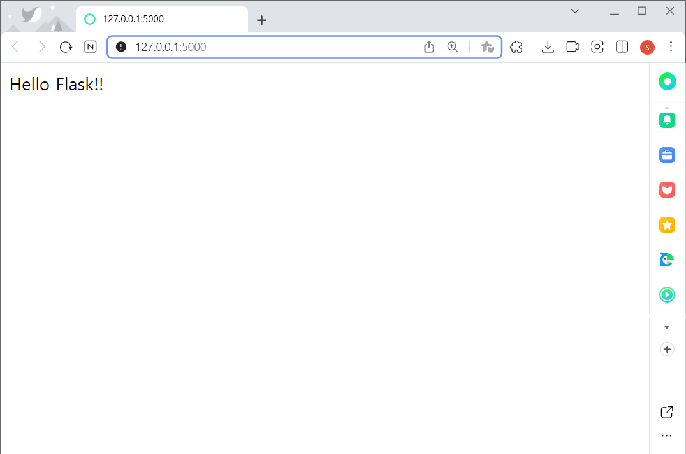


+ 장고실습했던것처럼 템플릿 만들어서 띄워주는것까지 해보면

새폴더 생성으로 `static` 폴더 만들어준다 (`static` 폴더에는 정적인 요소들이 들어간다)

`templates` 폴더도 만들어 주고 `templates` 폴더내에 뉴 파일로 `index.html` 파일 만들어준다.

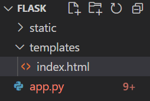


`index.html` 파일 에서 작업

```html
<!DOCTYPE html>
<html>
<head>
    <meta charset="UTF-8">
    <meta http-equiv="X-UA-Compatible" content="IE=edge">
    <meta name="viewport" content="width=device-width, initial-scale=1.0">
    <title>Hello Flask^^</title>
</head>
<body>
    <h1>{{name}}님 반갑습니다!</h1>
</body>
</html>
```


다시 `app.py` 로 와서

```python
@app.route('/user/<name>')
def user(name):  #name을 path 파라미터로 사용할거임.
    
    # suyeo -> s***o
    first_char = name[0]
    last_char = name[-1]
    
    stars = '*' * (len(name)-2)
    
    name_blind = f'{first_char}{stars}{last_char}'
    
    # 방법1 : attribs = {'name' : name_blind} 이렇게 딕셔너리 형태로 넘겨도됨. 장고였으면 이렇게 했을듯.
    
    # render_template : templates 폴더를 탐색해서 index.html 을 찾아낸다.
    return render_template('index.html',name = name_blind) # 방법2 : 어트리뷰트를 여기서 넘겨도 됨.
```

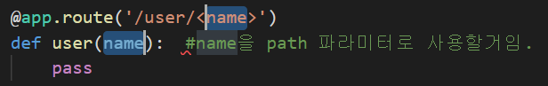


블럭처리한 두 파라미터의 이름은 항상 같아야함.


웹서버 확인

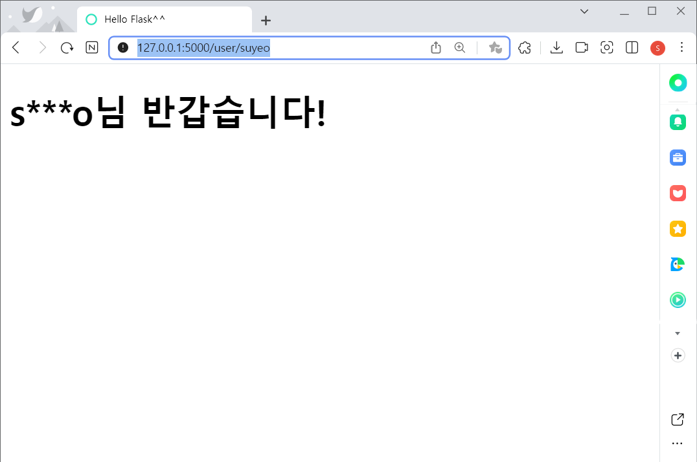

이렇게 이름을 넣으면 중간 철자는 ***으로 나오는걸 확인할수있다.


* 

```python
@app.route('/api/data')
def api_data():
    
    #####
    # MySQL에서 조회를 하던, MongoDB 를 활용해서 조회를 하던...
    #크롤링을 수행해서 데이터를 스크래이핑 하던....
    #####
    
    # JSON 으로 응답하기위해서는 dict 형태의 데이터가 필요하다!
    data = {
        'name' : 'suyeo',
        'age' : 24
    }
    
    # flask에 dict 형태의 데이터를 json 으로 만들어 줄수있는 함수가 있다.
    # jsonify 사용
    return jsonify(data)
```

전체코드

```python
from flask import *

app = Flask(__name__) #__name__: 실행될 함수, 모듈,... __main__이 들어가있다.

@app.route('/') #데코레이터로 작성
def home():
    return 'Hello Flask!!' # Plain Text

@app.route('/user/<name>')
def user(name):  #name을 path 파라미터로 사용할거임.
    
    # suyeo -> s***o
    first_char = name[0]
    last_char = name[-1]
    
    stars = '*' * (len(name)-2)
    
    name_blind = f'{first_char}{stars}{last_char}'
    
    # 방법1 : attribs = {'name' : name_blind} 이렇게 딕셔너리 형태로 넘겨도됨. 장고였으면 이렇게 했을듯.
    
    # render_template : templates 폴더를 탐색해서 index.html 을 찾아낸다.
    return render_template('index.html',name = name_blind) # 방법2 : 어트리뷰트를 여기서 넘겨도 됨.

@app.route('/api/data')
def api_data():
    
    #####
    # MySQL에서 조회를 하던, MongoDB 를 활용해서 조회를 하던...
    #크롤링을 수행해서 데이터를 스크래이핑 하던....
    #####
    
    # JSON 으로 응답하기위해서는 dict 형태의 데이터가 필요하다!
    data = {
        'name' : 'suyeo',
        'age' : 24
    }
    
    # flask에 dict 형태의 데이터를 json 으로 만들어 줄수있는 함수가 있다.
    # jsonify 사용
    return jsonify(data)

# '__main__' : 최초 실행된 위치(프로그램 시작 위치)
if __name__ == '__main__':
    app.run(debug=True)
```


웹 서버화면 출력

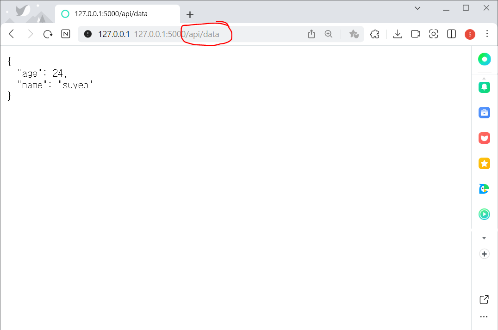


+ html 로 다시 가서 클릭버튼 코드 넣어주기

```html
    <button id="load_data">
        Click!!!
    </button>
```

전체코드

```html
<!DOCTYPE html>
<html>
<head>
    <meta charset="UTF-8">
    <meta http-equiv="X-UA-Compatible" content="IE=edge">
    <meta name="viewport" content="width=device-width, initial-scale=1.0">
    <title>Hello Flask^^</title>
</head>
<body>
    <h1>{{name}}님 반갑습니다!</h1>
    <button id="load_data">
        Click!!!
    </button>
</body>
</html>
```


웹 서버 출력화면

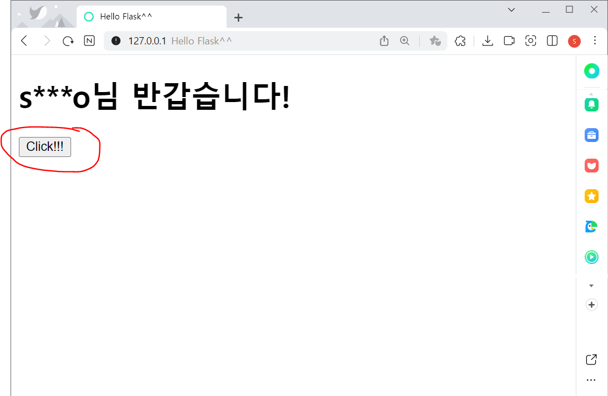


+ 버튼 클릭후 데이터 받아오기

```html
<ul id="data"></ul>
<script src="https://cdnjs.cloudflare.com/ajax/libs/jquery/3.4.1/jquery.js"></script>
<script>
    $('#load_data').on('click', function(){
        alert('Hello!');
    });
</script>
```


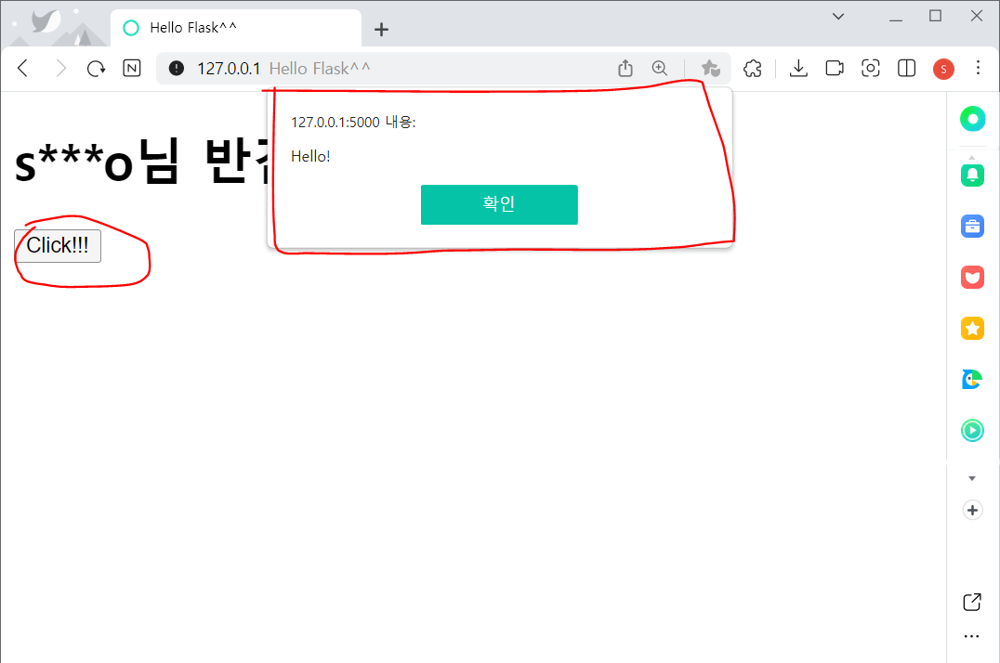


클릭버튼 누르면 이벤트창 이뜸.

load_data 를 클릭했을때 alert(Hello!) 를 뜨게 하겠단것.


+ `index_html` 에서 작업 - 콘솔 로그 작업, 비동기 통신

```html
// load_data 버튼을 클릭했을때 /api/data 에 요청
// 비동기 요청 - $.ajax, $.getJSON, ...

$.getJSON('/api/data', (response)=>{
    console.log(response)
});
```

서버한테 json 형태로 받아오기위한 함수다.


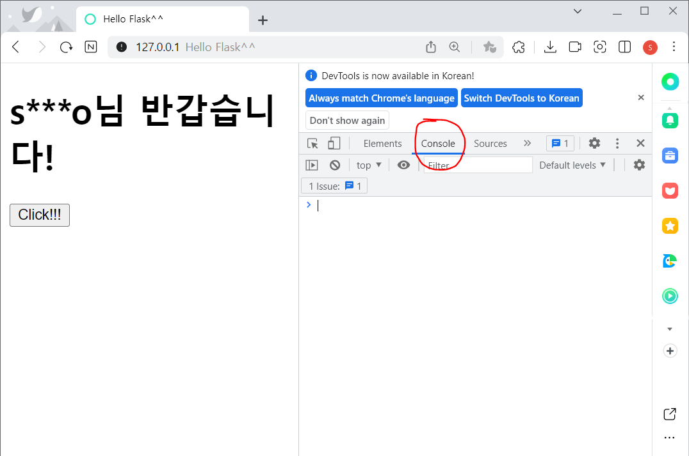


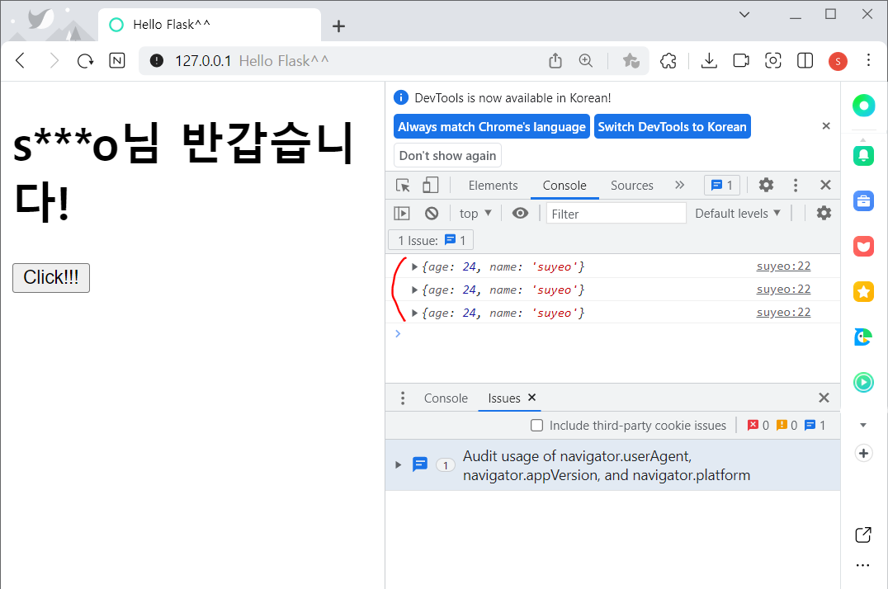


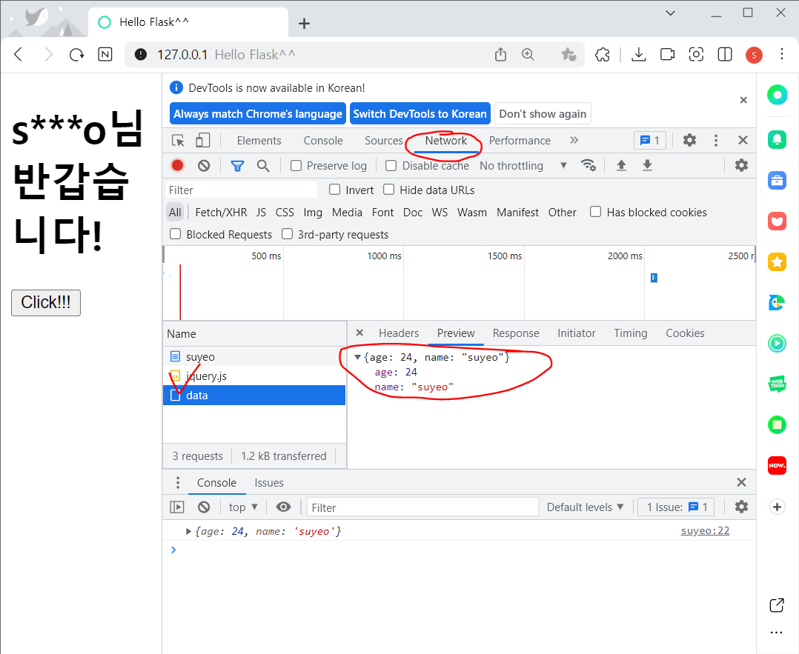


+ `index_html` 에서 작업 -태그 만들기 

```html
const tag = "<li>"+response.name + " / " + response.age + "</li>";
$('#data').append(tag);
```


전체코드

```html
<!DOCTYPE html>
<html>
<head>
    <meta charset="UTF-8">
    <meta http-equiv="X-UA-Compatible" content="IE=edge">
    <meta name="viewport" content="width=device-width, initial-scale=1.0">
    <title>Hello Flask^^</title>
</head>
<body>
    <h1>{{name}}님 반갑습니다!</h1>
    <button id="load_data">
        Click!!!
    </button>
    <ul id="data"></ul>
    <script src="https://cdnjs.cloudflare.com/ajax/libs/jquery/3.4.1/jquery.js"></script>
    <script>
        $('#load_data').on('click', function(){
            // alert('Hello!');
            // load_data 버튼을 클릭했을때 /api/data 에 요청
            // 비동기 요청 - $.ajax, $.getJSON, ...
            $.getJSON('/api/data', (response)=>{
                console.log(response);
                const tag = "<li>"+response.name + " / " + response.age + "</li>";
                $('#data').append(tag);
            });
        });
    </script>
</body>
</html>
```


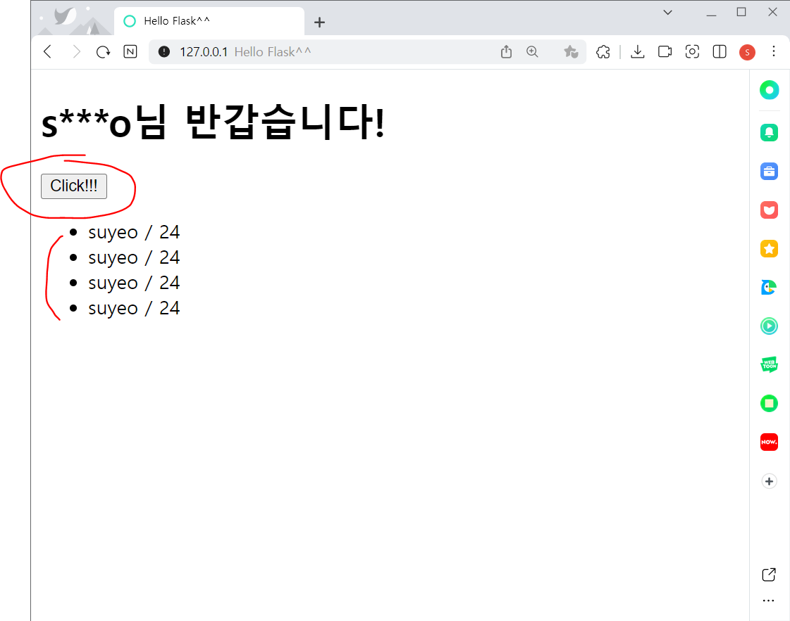


클릭버튼을 누르면 정보가 밑에 생김.


****


