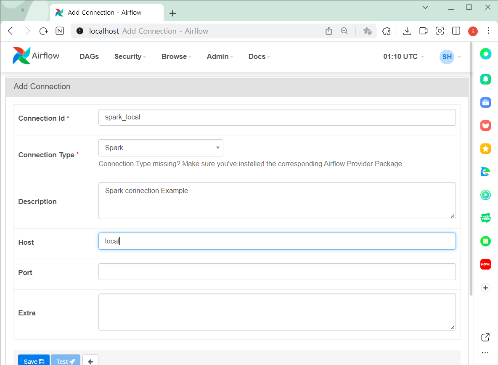
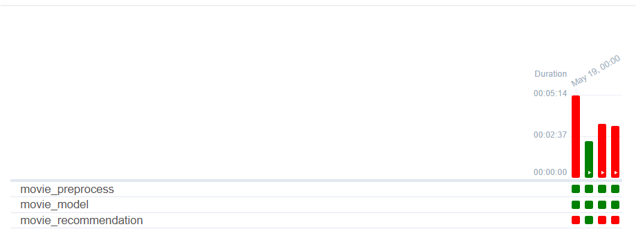

# 프로그램 설치


```powershell
(lab26_env) lab26@ip-000-00-00-0:~/airflow/dags$ pip3 install pyspark
```

```powershell
(lab26_env) lab26@ip-000-00-00-0:~/airflow/dags$ pip3 install apache-airflow-providers-apache-spark
```

```powershell
(lab26_env) lab26@ip-000-00-00-0:~/airflow/dags$ airflow webserver -p 8932
```

```powershell
(lab26_env) lab26@ip-000-00-00-0:~/airflow/dags$ export AIRFLOW__LOGGING__WORKER_LOG_SERVER_PORT=8726
(lab26_env) lab26@ip-000-00-00-0:~/airflow/dags$ airflow scheduler
```


# 실습1 Spark Pipeline 만들어보기

> 스파크 실행


## 예제 `count_trips.py` 

### [code](https://github.com/suyeee/todo_study/blob/master/220520_s.assets/count_trips.py)


### 실행

```powershell
(lab26_env) lab26@ip-000-00-00-0:~/airflow/dags$ spark-submit count_trips.py
```


## `spark-pipeline.py` 

>위에서 했던  `count_trips.py` 의 airflow 작업
>
>[code](https://github.com/suyeee/todo_study/blob/master/220520_s.assets/spark-pipeline.py)

```python
from datetime import datetime
from airflow import DAG 

# SparkSql을 airflow 상에서 실행하기 위한 Operator
from airflow.providers.apache.spark.operators.spark_submit import SparkSubmitOperator

default_args={
    "start_date": datetime(2022, 1, 1)
}

with DAG(
    dag_id="spark-pipeline",
    schedule_interval="@daily",
    default_args=default_args,
    tags=["spark"],
    catchup=False) as dag:

    submit_job = SparkSubmitOperator(
        application="/home/lab26/airflow/dags/count_trips.py",  # spark-submit 할 스파크 어플리케이션 경로
        task_id="submit_job",
        conn_id="spark_local"
    )
```


### `spark` 커넥션 추가 - `spark_local`




## [결과물](https://github.com/suyeee/todo_study/blob/master/220520_s.assets/trips_date.csv) 


# 실습2 택시비 예측 파이프라인 만들어보기 (`Airflow`)

```markdown
# 택시비 예측 파이프라인을 airflow로 구현

- preprocess : 전처리 파이프라인
    - DataLake에서 데이터 웨어하우스 및 마트 구축
- tune_hyperparameter : 하이퍼 파라미터 튜닝
    - 마트에서 데이터를 가지고와서 모델 하이퍼 파라미터를 구하기
    - 머신러닝 하이퍼 파라미터 저장
- train_model : 모델 훈련
    - 구해진 하이퍼 파라미터를 이용해서 훈련 진행

`preprocess >> tune_hyperparameter >> train_model`
```


## `preprocess.py` 

> 전처리 파이프라인 먼저 만들어주기


### [code](https://github.com/suyeee/todo_study/blob/master/220520_s.assets/preprocess.py)

```python
from pyspark.sql import SparkSession

MAX_MEMORY = "5g"
spark = SparkSession.builder.appName("taxi-fare-prediction")\
    .config("spark.executor.memory", MAX_MEMORY)\
    .config("spark.driver.memory", MAX_MEMORY)\
    .getOrCreate()

# Data Loading
trip_files = "/home/lab26/SparkCourse/data/trips/*"
trips_df = spark.read.csv(f"file:///{trip_files}", inferSchema=True, header=True)

# Table Regist
trips_df.createOrReplaceTempView("trips")

# Query 작성
query = """
SELECT
    passenger_count,
    PULocationID as pickup_location_id,
    DOLocationID as dropoff_location_id,
    trip_distance,
    HOUR(tpep_pickup_datetime) as pickup_time,
    DATE_FORMAT(TO_DATE(tpep_pickup_datetime), 'EEEE') AS day_of_week,
    total_amount
FROM
    trips
WHERE
    total_amount < 5000
    AND total_amount > 0
    AND trip_distance > 0
    AND trip_distance < 500
    AND passenger_count < 4
    AND TO_DATE(tpep_pickup_datetime) >= '2021-01-01'
    AND TO_DATE(tpep_pickup_datetime) < '2021-08-01'
"""

# Data warehouse 만들기
dw = spark.sql(query)

train_df, test_df = dw.randomSplit([0.8, 0.2], seed=42)

# train, test 데이터 세트 저장
data_dir = "/home/lab26/airflow/data"

# train_df와 test_df를 기록
train_df.write.format("parquet").mode("overwrite").save(f"{data_dir}/train/")
test_df.write.format("parquet").mode("overwrite").save(f"{data_dir}/test/")

spark.stop()
```


### 실행

> 정상적으로 실행이 잘 되는지 확인

```powershell
(lab26_env) lab26@ip-000-00-00-0:~/airflow/dags$ spark-submit preprocess.py
```


실행 다 끝나고 `airflow` 폴더의 하위 `data` 폴더 들어가보면 `train` 과 `test` 로 잘 나누어져서 저장되어있다.

작업 다끝났으면 `spark.stop()` 는 지워준다.


## `tune_hyperparameter.py`

> 하이퍼 파라미터 튜닝


### [code](https://github.com/suyeee/todo_study/blob/master/220520_s.assets/tune_hyperparameter.py)

```python
from pyspark.sql import SparkSession
from pyspark.ml import Pipeline

# feature 준비
from pyspark.ml.feature import OneHotEncoder, StringIndexer # 범주형 데이터를 다루기 위함
from pyspark.ml.feature import VectorAssembler, StandardScaler # 수치형 데이터를 다루기 위함

# Model
from pyspark.ml.regression import LinearRegression

# Validate, Tuning
from pyspark.ml.tuning import CrossValidator, ParamGridBuilder
from pyspark.ml.evaluation import RegressionEvaluator

MAX_MEMORY = "5g"
spark = SparkSession.builder.appName("taxi-fare-prediction")\
    .config("spark.executor.memory", MAX_MEMORY)\
    .config("spark.driver.memory", MAX_MEMORY)\
    .getOrCreate()

# 훈련데이터 가져오기
data_dir = "/home/lab26/airflow/data"
train_df = spark.read.parquet(f"{data_dir}/train/")

# 실무에선 사용자제. 수업이니까 이렇게 한것. (데이터의 양이 많은데 시간이 없으니)
toy_df = train_df.sample(False, 0.1, seed=42)  # 일부의 데이터를 랜덤하게 뽑는것

# Spark ML 파이프라인 구성하기

stages = []

# 범주형 데이터에 대한 파이프라인 구성
# StringIndexer => OneHotEncoder
cat_features = [
    "pickup_location_id",
    "dropoff_location_id",
    "day_of_week"
]

for c in cat_features:
    cat_indexer = StringIndexer(inputCol=c, outputCol=c+"_idx").setHandleInvalid("keep")
    onehot_encoder = OneHotEncoder(inputCols=[cat_indexer.getOutputCol()], outputCols=[c+"_onehot"])
    stages += [cat_indexer, onehot_encoder]

# 수치형 데이터들에 대한 처리
# 각 열을 모아서(VectorAssembler) => 표준화(StandardScaler)
num_features = [
    "passenger_count",
    "trip_distance",
    "pickup_time"
]

for n in num_features:
    num_assembler = VectorAssembler(inputCols=[n], outputCol=n+"_vector")
    num_scaler = StandardScaler(inputCol=num_assembler.getOutputCol(), outputCol=n+"_scaled")
    stages += [num_assembler, num_scaler]

# 훈련데이터(feature vector)를 만들기 위한 실제로 사용할 데이터에 대한 Assemble
assembler_input = [c+"_onehot" for c in cat_features] + [n+"_scaled" for n in num_features]  # 리스트와 리스트를 더해서 확장
assembler = VectorAssembler(inputCols=assembler_input, outputCol="features")
stages += [assembler]

# 모델 생성
lr = LinearRegression(
    maxIter=30,
    solver="normal",
    labelCol="total_amount",
    featuresCol="features"
)

# 모델도 스테이지에 등록
stages += [lr]

# 파이프라인 생성
# 모델을 훈련시키고 최적의 파라미터를 찾는 과정
pipeline = Pipeline(stages=stages)

# 하이퍼 파라미터 튜닝
# 하이퍼 파라미터 : 모델이 학습하는 값이 아닌, 사람이 직접 모델에 넣어주는 값

# ParamGridBuilder : 모델이 사용할 하이퍼 파라미터를 여러개 준비시키는것
param_grid = ParamGridBuilder()\
                .addGrid(lr.elasticNetParam, [0.1, 0.2, 0.3, 0.4, 0.5])\
                .addGrid(lr.regParam, [0.1, 0.2, 0.3, 0.4, 0.5])\
                .build()

cross_val = CrossValidator( estimator=pipeline,
                            estimatorParamMaps=param_grid,
                            evaluator=RegressionEvaluator(labelCol="total_amount"),
                            numFolds=5)

# 모델 훈련
cv_model = cross_val.fit(toy_df) # 실제로는 가지고있는 데이터세트 모두를 넣어줘야됨.

# 훈련이 끝났으면 성능이 제일 좋았던 모델을 가지고온다.
best_model = cv_model.bestModel.stages[-1]

# 성능이 제일 좋았던 하이퍼 파라미터만 뽑아내기

# LinearRegression 파라미터
bestElasticNetParam_alpha = best_model._java_obj.getElasticNetParam()
bestRegParam = best_model._java_obj.getRegParam()

hyperparams = {
    "alpha" : [bestElasticNetParam_alpha],
    'reg_param' : [bestRegParam]
}

import pandas as pd
hyper_df = pd.DataFrame(hyperparams).to_csv(f"{data_dir}/hyperparameter.csv")
```


### 실행

> 잘 작동하는지 확인한것. 근데 너무 오려걸려서 중간에 캔슬했다.

```powershell
(lab26_env) lab26@ip-000-00-00-0:~/airflow/dags$ spark-submit preprocess.py
```


## `train_model.py`

> 모델 훈련
>
> > 구해진 하이퍼 파라미터를 이용해서 훈련 진행


### [code](https://github.com/suyeee/todo_study/blob/master/220520_s.assets/train_model.py)

```python
from pyspark.sql import SparkSession
from pyspark.ml import Pipeline

# feature 준비
from pyspark.ml.feature import OneHotEncoder, StringIndexer 
from pyspark.ml.feature import VectorAssembler, StandardScaler 

# Model
from pyspark.ml.regression import LinearRegression

MAX_MEMORY = "5g"
spark = SparkSession.builder.appName("taxi-fare-prediction")\
    .config("spark.executor.memory", MAX_MEMORY)\
    .config("spark.driver.memory", MAX_MEMORY)\
    .getOrCreate()

# 훈련, 테스트 데이터 가져오기
data_dir = "/home/lab26/airflow/data"
train_df = spark.read.parquet(f"{data_dir}/train/")
test_df = spark.read.parquet(f"{data_dir}/test/")

# 구해놨던 하이퍼 파라미터 가져오기
import pandas as pd
hyper_df = pd.read_csv(f"{data_dir}/hyperparameter.csv")

alpha = float(hyper_df.iloc[0]['alpha'])
reg_param = float(hyper_df.iloc[0]['reg_param'])

# Spark ML 파이프라인 구성하기

stages = []

# 범주형 데이터에 대한 파이프라인 구성
# StringIndexer => OneHotEncoder
cat_features = [
    "pickup_location_id",
    "dropoff_location_id",
    "day_of_week"
]

for c in cat_features:
    cat_indexer = StringIndexer(inputCol=c, outputCol=c+"_idx").setHandleInvalid("keep")
    onehot_encoder = OneHotEncoder(inputCols=[cat_indexer.getOutputCol()], outputCols=[c+"_onehot"])
    stages += [cat_indexer, onehot_encoder]

# 수치형 데이터들에 대한 처리
# 각 열을 모아서(VectorAssembler) => 표준화(StandardScaler)
num_features = [
    "passenger_count",
    "trip_distance",
    "pickup_time"
]

for n in num_features:
    num_assembler = VectorAssembler(inputCols=[n], outputCol=n+"_vector")
    num_scaler = StandardScaler(inputCol=num_assembler.getOutputCol(), outputCol=n+"_scaled")
    stages += [num_assembler, num_scaler]

# 훈련데이터(feature vector)를 만들기 위한 실제로 사용할 데이터에 대한 Assemble
assembler_input = [c+"_onehot" for c in cat_features] + [n+"_scaled" for n in num_features]  # 리스트와 리스트를 더해서 확장
assembler = VectorAssembler(inputCols=assembler_input, outputCol="features")
stages += [assembler]


# 오로지 데이터 변환(Transformation) 만을 위한 파이프라인 생성
pipeline = Pipeline(stages=stages)

# 데이터 변환
fitted_transformer = pipeline.fit(train_df)  # Transformation 작업
vec_train_df = fitted_transformer.transform(train_df)  # Action (실제 변환이 일어나는 곳)

# 모델 정의 - 하이퍼 파라미터 사용
lr = LinearRegression(
    maxIter=50,
    solver="normal",
    labelCol="total_amount",
    featuresCol="features",

    # GridSearch로 구한 파라미터 넣어주기
    elasticNetParam=alpha,
    regParam=reg_param
)

# 모델 객체 생성은 훈련(fit)이 끝나고 만들어진다.
model = lr.fit(vec_train_df)

# 테스트 세트 예측
vec_test_df = fitted_transformer.transform(test_df) 
predictions = model.transform(vec_test_df)
predictions.select(["trip_distance", "day_of_week", "total_amount", "prediction"]).show()
predictions_df = pd.DataFrame(predictions).to_csv(f"{data_dir}/predictions.csv")

# 모델 저장
model_dir = "/home/lab26/airflow/data/model"
model.write().overwrite().save(model_dir)
```


### 모델 불러오는법

```python
from pyspark.ml.recommendation import ALSModel

model = ALSModel.load("/home/lab26/airflow/data/model")
```


## 배치 데이터 프로세싱

> 그림은 수업자료 참고


+ 맨 왼쪽 주황색 영역에 해당하는게 `preprocess.py` 
  + DataLake 에서 데이터 웨어하우스, 마트를 구축한다
  + 훈련세트와 테스트 세트를 만드는 전처리 작업을 한다
+ 가운데 영역 `tune_hyperparameter.py`
  + 성능이 제일 좋았던 모델에서 하이퍼 파라미터만 뽑아내서 저장해준다.
+ 마지막 영역 `train_model.py`
  + 구해놨던 하이퍼 파라미터를 이용해 모델을 만들고 훈련후 테스트 세트로 예측한다.


## `spark-ml-pipeline.py`

> 파이프라인 구축 (Airflow)


### [code](https://github.com/suyeee/todo_study/blob/master/220520_s.assets/spark-ml-pipeline.py)

```python
# airflow
from datetime import datetime 
from airflow import DAG

from airflow.providers.apache.spark.operators.spark_submit import SparkSubmitOperator

default_args={
    "start_date": datetime(2022, 1, 1)
}

with DAG(
    dag_id="spark-ml-pipeline",
    schedule_interval="@daily",
    default_args=default_args,
    tags=["spark",'ml','taxi'],
    catchup=False) as dag:

    submit_preprocess = SparkSubmitOperator(
        application="/home/lab26/airflow/dags/preprocess.py",  # spark-submit 할 스파크 어플리케이션 경로
        task_id="submit_preprocess",
        conn_id="spark_local"
    )

    submit_tune_hyperparameter = SparkSubmitOperator(
        application="/home/lab26/airflow/dags/tune_hyperparameter.py", 
        task_id="submit_tune_hyperparameter",
        conn_id="spark_local"
    )

    submit_train_model = SparkSubmitOperator(
        application="/home/lab26/airflow/dags/train_model.py", 
        task_id="submit_train_model",
        conn_id="spark_local"
    )

    submit_preprocess >> submit_tune_hyperparameter >> submit_train_model
```


### 실행

> 시간이 오래걸려서 실행은 안했다.


# 과제

> 영화 추천 파이프라인 구축
>
> `movie_preprocess` >> `movie_model` >> `movie_recommendation`


## `movie_preprocess.py`

> 전처리
>
> [code](https://github.com/suyeee/todo_study/blob/master/220520_s.assets/movie_preprocess.py)


```python
from pyspark.sql import SparkSession

MAX_MEMORY = "5g"

spark = SparkSession.builder.appName("movie-recommendation")\
    .config("spark.executor.memory", MAX_MEMORY)\
    .config("spark.driver.memory", MAX_MEMORY)\
    .getOrCreate()

# 데이터 불러오기
directory = "/home/lab26/SparkCourse/data/ml-25m"
ratings_file = "ratings.csv"
ratings_df = spark.read.csv(f"file:///{directory}/{ratings_file}", inferSchema=True, header=True)

# `timestamp`는 빼고 선택
ratings_df = ratings_df.select(["userId", "movieId", "rating"])

# 훈련, 테스트 세트 분리하기
train_df, test_df = ratings_df.randomSplit([0.8, 0.2], seed=42)

# 데이터 저장
data_dir = "/home/lab26/airflow/movie_data"

# train_df와 test_df를 기록 한다.
train_df.write.format("parquet").mode("overwrite").save(f"{data_dir}/train/")
test_df.write.format("parquet").mode("overwrite").save(f"{data_dir}/test/")
```


## `movie_model.py`

> 영화 추천 모델 만들기
>
> [code](https://github.com/suyeee/todo_study/blob/master/220520_s.assets/movie_model.py)


```python
from pyspark.sql import SparkSession
from pyspark.ml.recommendation import ALS

MAX_MEMORY = "5g"

spark = SparkSession.builder.appName("movie-recommendation")\
    .config("spark.executor.memory", MAX_MEMORY)\
    .config("spark.driver.memory", MAX_MEMORY)\
    .getOrCreate()

# 훈련, 테스트 세트 불러오기
data_dir = "/home/lab26/airflow/movie_data"
train_df = spark.read.parquet(f"{data_dir}/train/")
test_df = spark.read.parquet(f"{data_dir}/test/")

als = ALS(
    maxIter=5, # 훈련 반복 횟수
    regParam=0.1,
    
    userCol="userId",
    itemCol="movieId",
    ratingCol="rating",
    
    coldStartStrategy="drop" # 학습하지 못한 데이터에 대한 처리
)

als_model = als.fit(train_df)

# 모델 저장
model_dir = "/home/lab26/airflow/movie_data/model"
als_model.write().overwrite().save(model_dir)
```


## `movie_recommendation.py`

> 만든 모델 적용해서 영화 추천하기 
>
> [code](https://github.com/suyeee/todo_study/blob/master/220520_s.assets/movie_recommendation.py)


```python
from pyspark.sql import SparkSession
from pyspark.ml.recommendation import ALSModel
from pyspark.sql.types import IntegerType

MAX_MEMORY = "5g"

spark = SparkSession.builder.appName("movie-recommendation")\
    .config("spark.executor.memory", MAX_MEMORY)\
    .config("spark.driver.memory", MAX_MEMORY)\
    .getOrCreate()

# 테스트 데이터 불러오기
data_dir = "/home/tutor/airflow/movie_data"
test_df  = spark.read.parquet(f"{data_dir}/test/")

# 모델 불러오기
model = ALSModel.load("/home/lab26/airflow/movie_data/model")

test_user_ids = test_df.select("userId")

# 영화이름 확인
directory = "/home/lab26/SparkCourse/data/ml-25m"
movies_files = "movies.csv"
movies_df = spark.read.csv(f"file:///{directory}/{movies_files}", inferSchema=True, header=True)

def get_recommendations(num_recs=5):
    
    # 각 user에 대해 top 5 추천
    user_recs_df = model.recommendForUserSubset(test_user_ids, num_recs)
    
    recs_list = user_recs_df.collect()[0].recommendations
    recs_df   = spark.createDataFrame(recs_list)
    
    # DataFrame의 join 함수 사용하기
    recommended_movies = recs_df.join(movies_df, "movieId")
    
    return recommended_movies

# csv로 저장
recs = get_recommendations()
recs.toPandas().to_csv("movie-recommendation.csv")
```


## `movie-pipeline.py`

> 파이프라인 구축(Airflow)
>
> [code](https://github.com/suyeee/todo_study/blob/master/220520_s.assets/movie-pipeline.py)


```python
from datetime import datetime 
from airflow import DAG

from airflow.providers.apache.spark.operators.spark_submit import SparkSubmitOperator

default_args={
    "start_date": datetime(2022, 1, 1)
}

with DAG(
    dag_id="movie-pipeline",
    schedule_interval="@daily",
    default_args=default_args,
    tags=["spark",'ml','movie'],
    catchup=False) as dag:

    movie_preprocess = SparkSubmitOperator(
        application="/home/lab26/airflow/dags/movie_preprocess.py",  # spark-submit 할 스파크 어플리케이션 경로
        task_id="movie_preprocess",
        conn_id="spark_local"
    )

    movie_model = SparkSubmitOperator(
        application="/home/lab26/airflow/dags/movie_model.py", 
        task_id="movie_model",
        conn_id="spark_local"
    )

    movie_recommendation = SparkSubmitOperator(
        application="/home/lab26/airflow/dags/movie_recommendation.py", 
        task_id="movie_recommendation",
        conn_id="spark_local"
    )

    movie_preprocess >> movie_model >> movie_recommendation
    
```




`movie_recommendation.py`  여기서 자꾸 에러뜸. 내일 수정해야됨. 함수 쓰지말고 그냥 해야될듯함.


# 도커 설치

> 다음주부터 Kafka 수업을 할꺼기때문에 가상환경에 도커를 설치해준것.


`ubuntu`로 접속

```powershell
PS C:\Users\suyeo> cd .ssh
```

```powershell
PS C:\Users\suyeo\.ssh> sudo ssh -i 'de-G-04.pem' ubuntu@00.000.000.00
```

`sudo` 로 접속안되서 `sudo` 빼고서 접속했음


다운

```powershell
ubuntu@ip-000-00-00-0:~$ curl -s https://get.docker.com | sudo sh
```


개인계정으로 접속

```powershell
ubuntu@ip-000-00-00-0:~$ sudo usermod -aG docker lab26
```


도커 설치

```powershell
ubuntu@ip-000-00-00-0:~$ sudo apt install docker-compose
```

```powershell
ubuntu@ip-000-00-00-0:~$ exit
```


개인계정으로 접속

```powershell
PS C:\Users\suyeo\.ssh> ssh -i 'de-G-04.pem' lab26@00.000.000.00 또는
PS C:\Users\suyeo\.ssh> sudo ssh -i 'de-G-04.pem' lab26@00.000.000.00 로 접속
```


도커 버전 확인

```powershell
lab26@ip-000-00-00-0:~$ docker-compose version
docker-compose version 1.17.1, build unknown
docker-py version: 2.5.1
CPython version: 2.7.17
OpenSSL version: OpenSSL 1.1.1  11 Sep 2018
```


