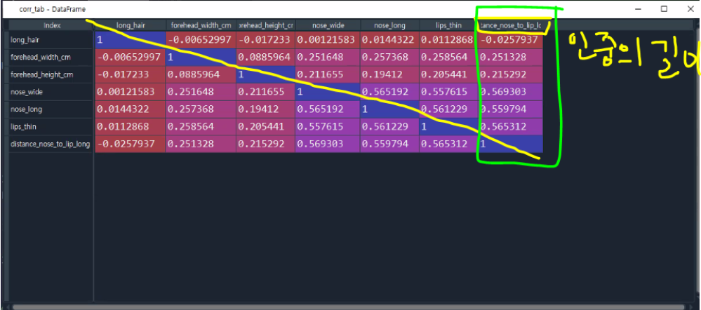
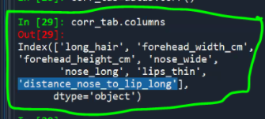
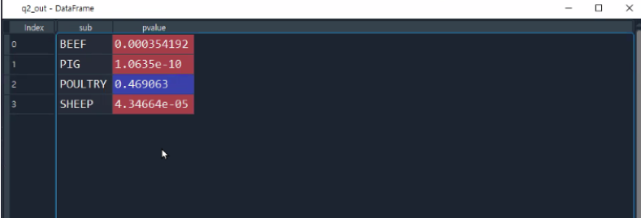
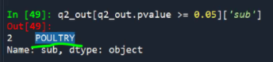
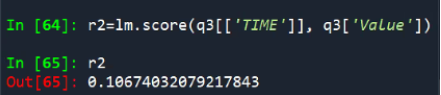
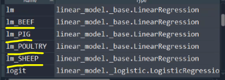
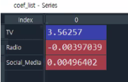
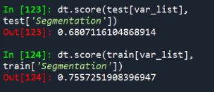
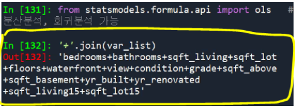
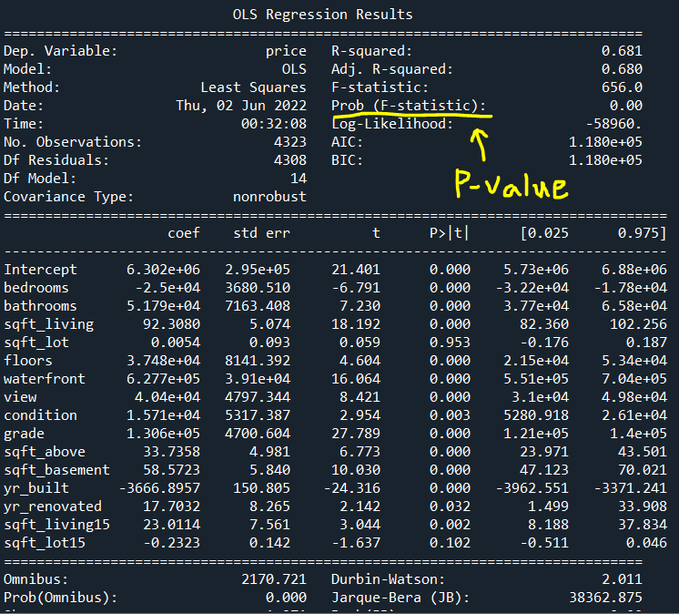

# 예제3

```python
# =============================================================================
# =============================================================================
# # 문제 03 유형(DataSet_03.csv 이용)
# 
# 구분자 : comma(“,”), 5,001 Rows, 8 Columns, UTF-8 인코딩
# 안경 체인을 운영하고 있는 한 회사에서 고객 사진을 바탕으로 안경의 사이즈를
# 맞춤 제작하는 비즈니스를 기획하고 있다. 우선 데이터만으로 고객의 성별을
# 파악하는 것이 가능할 지를 연구하고자 한다.
#
# 컬 럼 / 정 의 / Type
# long_hair / 머리카락 길이 (0 – 길지 않은 경우 / 1 – 긴
# 경우) / Integer
# forehead_width_cm / 이마의 폭 (cm) / Double
# forehead_height_cm / 이마의 높이 (cm) / Double
# nose_wide / 코의 넓이 (0 – 넓지 않은 경우 / 1 – 넓은 경우) / Integer
# nose_long / 코의 길이 (0 – 길지 않은 경우 / 1 – 긴 경우) / Integer
# lips_thin / 입술이 얇은지 여부 0 – 얇지 않은 경우 / 1 –
# 얇은 경우) / Integer
# distance_nose_to_lip_long / 인중의 길이(0 – 인중이 짧은 경우 / 1 – 인중이
# 긴 경우) / Integer
# gender / 성별 (Female / Male) / String
# =============================================================================
# =============================================================================
```


## 3번

```python
# =============================================================================
# 3.주어진 데이터를 사용하여 성별을 구분할 수 있는지 로지스틱 회귀분석을 적용하여
# 알아 보고자 한다. 
# - 데이터를 7대 3으로 나누어 각각 Train과 Test set로 사용한다. 이 때 seed는 123으로
# 한다.
# - 원 데이터에 있는 7개의 변수만 Feature로 사용하고 gender를 label로 사용한다.
# (forehead_ratio는 사용하지 않음)
# - 로지스틱 회귀분석 예측 함수와 Test dataset를 사용하여 예측을 수행하고 정확도를
# 평가한다. 이 때 임계값은 0.5를 사용한다. 
# - Male의 Precision 값을 소수점 둘째 자리까지 반올림하여 기술하시오. (답안 예시) 
# 0.12
# 
# 
# (참고) 
# from sklearn.linear_model import LogisticRegression
# from sklearn.model_selection import train_test_split
# from sklearn import metrics
# train_test_split 의 random_state = 123
# =============================================================================
```


**선형회귀**

> 설명은 강의자료 참고


**시그모이드 함수**

> 설명은 강의자료 참고


**Precision**


$$
Precision = \frac{TP}{TP+FP}
$$


+ 실제보다 작을수 있음.
+ 어떤 결과값이 리턴이 되는지 알아야됨.
+ 확률값이 주어졌다해서 무조건 사용하는건 아님.
+ 경계값은 고정값이 아니기에 조정이 가능함.


```python
from sklearn.linear_model import LogisticRegression
from sklearn.model_selection import train_test_split

# data3.columns
# 출력결과: ['long_hair', 'forehead_width_cm', 'forehead_height_cm', 'nose_wide',
       'nose_long', 'lips_thin', 'distance_nose_to_lip_long', 'gender',
       # 'forehead_ratio']


var_list = data3.columns.drop('gender') # gender를 label로 사용하기 위해 분리
train, test = train_test_split(data3, test_size=0.3, random_state=123) # 언패킹

logit = LogisticRegression().fit(train[var_list], train['gender'])

dir(logit)

logit.coef_
logit.intercept_

pred_class = logit.predict(test[var_list])
pred_pr = logit.predict_proba(test[var_list])

pred_class2 = np.where(pred_pr[:, 1] >= 0.8, 'Male', 'Female') # 0.8은 경계값(임계값)


# 성능평가
from sklearn.metrics import classification_report

print(classification_report(test['gender'], pred_class))


# 문제에서는 임계값을 0.5로 사용하라했으니 입계값만 바꿔서 'Precision'을 구하면된다.
```


**산술평균 외의 기타 다른 평균들**

+ 가중평균
+ 조화평균


# 예제4

```python
# =============================================================================
# =============================================================================
# # 문제 04 유형(DataSet_04.csv 이용)
#
#구분자 : comma(“,”), 6,718 Rows, 4 Columns, UTF-8 인코딩

# 한국인의 식생활 변화가 건강에 미치는 영향을 분석하기에 앞서 육류
# 소비량에 대한 분석을 하려고 한다. 확보한 데이터는 세계 각국의 1인당
# 육류 소비량 데이터로 아래와 같은 내용을 담고 있다.

# 컬 럼 / 정 의 / Type
# LOCATION / 국가명 / String
# SUBJECT / 육류 종류 (BEEF / PIG / POULTRY / SHEEP) / String
# TIME / 연도 (1990 ~ 2026) / Integer
# Value / 1인당 육류 소비량 (KG) / Double
# =============================================================================
# =============================================================================

# (참고)
# #1
# import pandas as pd
# import numpy as np
# #2
# from scipy.stats import ttest_rel
# #3
# from sklearn.linear_model import LinearRegression
```


```python
import pandas as pd
import numpy as np

data4=pd.read_csv('Dataset_04.csv')

data4.columns
#['LOCATION', 'SUBJECT', 'TIME', 'Value']
```


## 1번

```python
# =============================================================================
# 1.한국인의 1인당 육류 소비량이 해가 갈수록 증가하는 것으로 보여 상관분석을 통하여
# 확인하려고 한다. 
# - 데이터 파일로부터 한국 데이터만 추출한다. 한국은 KOR로 표기되어 있다.
# - 년도별 육류 소비량 합계를 구하여 TIME과 Value간의 상관분석을 수행하고
# 상관계수를 소수점 셋째 자리에서 반올림하여 소수점 둘째 자리까지만 기술하시오. 
# (답안 예시) 0.55
# =============================================================================
```


```python
q1 = data4[data4.LOCATION == 'KOR']
# 또는 data4[data4.LOCATION.isin(['KOR', 'JPN'])] 사용가능
# isin은 여러개 동시에 필터링 가능

tab = q1.groupby('TIME')['Value'].sum().reset_index(drop=False)

round(tab.corr()['Value']['TIME'],2)

# 답: 0.96
```


**공분산**


$$
공분산 = \frac{\sum(X_i-\bar{X}) (Y_i-\bar{Y})}{n}
$$


**상관계수**


$$
-1 < corr(X,Y) < 1
$$

+ 상관계수는 절대값을 취한값이 1이하를가짐.

+ 상관계수 절대값을 취한 값이 0.6 이상이면 상관관계가 높다고 판단함.


++ 데이터3 (예제3 데이터)의 상관분석

```python
#data3.corr(): 자동으로 문자열 변수들을 제외한 변수들로 상관관계 분석을 해준다.
corr_tab = data3.corr()

# 인중의 길이(distance_nose_to_lip_long)와 가장 상관관계가 높은것은?
corr_tab.columns

qq = corr_tab['distance_nose_to_lip_long'].drop('distance_nose_to_lip_long').abs()

# 상관관계가 가장높은 변수명 추출
qq.idxmax()

```


**`corr_tab` : 상관관계 분석 테이블**




**상관관계 테이블(`corr_tab`)의 컬럼 추출**




**`idxmax()`**


## 2번

```python
# =============================================================================
# 2. 한국 인근 국가 가운데 식생의 유사성이 상대적으로 높은 일본(JPN)과 비교하여, 연도별
# 소비량에 평균 차이가 있는지 분석하고자 한다.
# - 두 국가의 육류별 소비량을 연도기준으로 비교하는 대응표본 t 검정을 수행하시오.
# - 두 국가 간의 연도별 소비량 차이가 없는 것으로 판단할 수 있는 육류 종류를 모두
# 적으시오. (알파벳 순서) (답안 예시) BEEF, PIG, POULTRY, SHEEP
# =============================================================================
```


**육류 종류별로 한국, 일본 대응 테이블을 만들어야됨**

+ 결측치는 제외가 되도록 설계

+ H0: 두 국가 간의 연도별 소비량 차이가 없다
+ H1: 두 국가 간의 연도별 소비량 차이가 있다


```python
q2 = data4[data4.LOCATION.isin(['KOR', 'JPN'])]
q2.LOCATION.value_counts() # 결측치 존재 확인

sub_list = q2.SUBJECT.unique()
# 출력결과 : ['BEEF', 'PIG', 'POULTRY', 'SHEEP']


# 프로세스 : 육류 종류별로 필터링 -> 테이블(결측치 제외) -> 대응인 t 검정 -> 결과물을 누적 저장

from scipy.stats import ttest_rel # 대응인 t 검정용 함수

q2_out=[]
for i in sub_list:
    temp = q2[q2.SUBJECT == i]
	tab = pd.pivot_table(temp,
                    index='TIME', # 행방향
                    columns='LOCATION', # 열방향
                    values='Value' # 집계를 내야하는 변수
                    # aggfunc='mean'이 디폴트 파라미터
                     ).dropna() # 결측치 제거
    
    ttest_out = ttest_rel(tab['KOR'],tab['JPN'])
    pvalue = ttest_out.pvalue 
    q2_out.append([i, pvalue]) # 결과 저장

q2_out = pd.DataFrame(q2_out, columns=['sub', 'pvalue'])
q2_out[q2_out.pvalue >= 0.05]['sub']  # p-value 가 0.05보다 큰 육류종류만 추출

# 답: POULTRY
```


**`q2_out` 을 데이터프레임으로 변환**




**pvalue에서 답 추출**




## 3번

```python
# =============================================================================
# 3.(한국만 포함한 데이터에서) Time을 독립변수로, Value를 종속변수로 하여 육류
# 종류(SUBJECT) 별로 회귀분석을 수행하였을 때, 가장 높은 결정계수를 가진 모델의
# 학습오차 중 MAPE를 반올림하여 소수점 둘째 자리까지 기술하시오. (답안 예시) 21.12
# (MAPE : Mean Absolute Percentage Error, 평균 절대 백분율 오차)
# (MAPE = Σ ( | y - y ̂ | / y ) * 100/n 
# 
# =============================================================================
```


```python
q3 = data4[data4.LOCATION == 'KOR']

from sklearn.linear_model import LinearRegression

---------------------------------------------------------------------------
#%%
# for문에 넣기 전 test
# fit_intercept: 상수항 포함여부 옵션
# q3['TIME'] 괄호를 한개만 쓰면 배열 구조로 바꾸라는 경고가뜸.
lm = LinearRegression(fit_intercept=True).fit(q3[['TIME']], q3['Value'])  
pred = lm.predict(q3[['TIME']])

# score에 학습에 사용했던 데이터를 넣어준다.
r2 = lm.score(q3[['TIME']], q3['Value'])

#MAPE = Σ ( | y - y ̂ | / y ) * 100/n 
# q3['Value']: y값
# abs: 절대값
mape = (abs(q3['Value'] - pred)/ q3['Value']).sum() * 100 / len(q3)
-----------------------------------------------------------------------------


# for 문에 적용
q3_out=[]

for i in sub_list:
    temp = q3[q3.SUBJECT == i]
    
    lm = LinearRegression(fit_intercept=True).fit(temp[['TIME']], temp['Value'])  
    pred = lm.predict(temp[['TIME']])

    r2 = lm.score(temp[['TIME']], temp['Value'])
    
    mape = (abs(temp['Value'] - pred)/ temp['Value']).sum() * 100 / len(temp)
    q3_out.append([i, r2, mape])

    
q3_out = pd.DataFrame(q3_out, columns['sub', 'r2', 'mape'])
    
q3_out.iloc[q3_out.r2.argmax(), 2]
# 또는 q3_out.loc[q3_out.r2.idxmax(), 'mape']

# 답: 5.78
    
## [참고]
--육류 종류별로 회귀모델 재사용하기--
for i in sub_list:
    temp = q3[q3.SUBJECT == i]
    # 반복적으로 for 문을 돌때마다 육류 종류마다의 회귀모델이 만들어지게됨.
    globals()['lm_'+i] = LinearRegression(fit_intercept=True).fit(temp[['TIME']], temp['Value']) 

-- 각 육류 종류마다의 회귀모델 사용하기--
temp = q3[q3.SUBJECT == 'BEEF']
eval('lm_BEEF').predict(temp[['TIME']])


# [참고]_배열구조
q3['TIME'].ndim
q3['TIME'].shape

q3[['TIME']].ndim
q3[['TIME']].shape

q3['time'].values  # array 구조
q3['time'].values.reshape(-1, 1).shape

```


**선형회귀식**


$$
Value = b_0 + b_1 * 입력변수
$$


+ 대부분 상수항이 들어가는 모델로 채택을 한다.
+ 상수항은 넣어주는게 좋다. 결과는 비슷하게 나오는데 식 모양이 달라진다.


**데이터 구조**

+ `array` 구조로 변경하면 `array` 메소드를 사용할수있게됨. 
  + ex) `reshape` 메소드 등등


**결정계수, r2**

+ E[y|x]: x가 주어졌을때 y에 대한 기댓값
+ R2 -> 데이터의 설명력이 높은 모델을 찾겠다는 의미


**`r2(결정계수)` 출력 결과**




**육류 종류마다의 회귀모델이 만들어진 모습**




**F 통계량**

> 강의자료 참고


$$
F 통계량 = \frac{MSR}{MSE}
$$


**비용함수**

> 강의자료 참고


**그레디언트 디센트 기법**

> 강의자료 참고


# 예제1

```python
# =============================================================================
# =============================================================================
# # 문제 01 유형(DataSet_01.csv 이용)
#
# 구분자 : comma(“,”), 4,572 Rows, 5 Columns, UTF-8 인코딩
# 
# 글로벌 전자제품 제조회사에서 효과적인 마케팅 방법을 찾기
# 위해서 채널별 마케팅 예산과 매출금액과의 관계를 분석하고자
# 한다.
# 컬 럼 / 정 의  /   Type
# TV   /     TV 마케팅 예산 (억원)  /   Double
# Radio / 라디오 마케팅 예산 (억원)  /   Double
# Social_Media / 소셜미디어 마케팅 예산 (억원)  / Double
# Influencer / 인플루언서 마케팅
# (인플루언서의 영향력 크기에 따라 Mega / Macro / Micro / 
# Nano) / String

# SALES / 매출액 / Double
# =============================================================================
# =============================================================================
```


```python
import pandas as pd
import numpy as np

data1=pd.read_csv('Dataset_01.csv')
data1.columns
# ['TV', 'Radio', 'Social_Media', 'Influencer', 'Sales']
```


## 1번

> 결측치가 있으면 사이킷런을 사용하지 못하니 결측치부터 확인

```python
# =============================================================================
# 1. 데이터 세트 내에 총 결측값의 개수는 몇 개인가? (답안 예시) 23
# =============================================================================
```


```python
# 각 컬럼별로 결측치 갯수 확인 가능
data1.isna().sum()

# 결측 셀의 수
data1.isna().sum().sum()

# 답: 26

# 결측치가 포함된 행의 갯수
# any(axis=1): 행방향으로 하나라도 결측치가 있으면 불러줌.
data1.isna().any(axis=1).sum()
```


## 2번

```python
# =============================================================================
# 2. TV, Radio, Social Media 등 세 가지 다른 마케팅 채널의 예산과 매출액과의 상관분석을
# 통하여 각 채널이 매출에 어느 정도 연관이 있는지 알아보고자 한다. 
# - 매출액과 가장 강한 상관관계를 가지고 있는 채널의 상관계수를 소수점 5번째
# 자리에서 반올림하여 소수점 넷째 자리까지 기술하시오. (답안 예시) 0.1234
# =============================================================================
```


**켄달의 상관관계(`Kendall's correlation coefficient`)**

> 강의자료 참고

+ 스피어만, 피어슨 상관계수말고도 다른 방법으로도 상관계수를 구할수있다.


```python
var_list = ['TV', 'Radio', 'Social_Media', 'Sales']

q2 = data1[var_list].corr().drop(index = 'Sales')['Sales'].abs()

round(q2.max(), 4)
# 출력결과: 0.9995

q2.idxmax()
# 출력결과: 'TV'

# 답: 0.9995
```


## 3번

```python
# =============================================================================
# 3. 매출액을 종속변수, TV, Radio, Social Media의 예산을 독립변수로 하여 회귀분석을
# 수행하였을 때, 세 개의 독립변수의 회귀계수를 큰 것에서부터 작은 것 순으로
# 기술하시오. 
# - 분석 시 결측치가 포함된 행은 제거한 후 진행하며, 회귀계수는 소수점 넷째 자리
# 이하는 버리고 소수점 셋째 자리까지 기술하시오. (답안 예시) 0.123
# =============================================================================
```


```python
from sklearn.linear_model import LinearRegression

var_list = ['TV', 'Radio', 'Social_Media']

# 결측치 제거후 실행 -> 결측치가 있으면 fit이 안됨.
q3 = data1.dropna()
lm = LinearRegression().fit(q3[var_list], q3['Sales'])

coef_list = pd.Series(lm.coef_, index=var_list)

np.floor(coef_list.sort_values(ascendong=False).values *1000) /1000

# 답: [3.562, 0.004, -0.004]
```


**회귀계수**




# 예제5

```python
# =============================================================================
# =============================================================================
# # 문제 05 유형(DataSet_05.csv 이용)
#
# 구분자 : comma(“,”), 8,068 Rows, 12 Columns, UTF-8 인코딩
#
# A자동차 회사는 신규 진입하는 시장에 기존 모델을 판매하기 위한 마케팅 전략을 
# 세우려고 한다. 기존 시장과 고객 특성이 유사하다는 전제 하에 기존 고객을 세분화하여
# 각 그룹의 특징을 파악하고, 이를 이용하여 신규 진입 시장의 마케팅 계획을 
# 수립하고자 한다. 다음은 기존 시장 고객에 대한 데이터이다.
#

# 컬 럼 / 정 의 / Type
# ID / 고유 식별자 / Double
# Age / 나이 / Double
# Age_gr / 나이 그룹 (10/20/30/40/50/60/70) / Double
# Gender / 성별 (여성 : 0 / 남성 : 1) / Double
# Work_Experience / 취업 연수 (0 ~ 14) / Double
# Family_Size / 가족 규모 (1 ~ 9) / Double
# Ever_Married / 결혼 여부 (Unknown : 0 / No : 1 / Yes : 2) / Double
# Graduated / 재학 중인지 여부 / Double
# Profession / 직업 (Unknown : 0 / Artist ~ Marketing 등 9개) / Double
# Spending_Score / 소비 점수 (Average : 0 / High : 1 / Low : 2) / Double
# Var_1 / 내용이 알려지지 않은 고객 분류 코드 (0 ~ 7) / Double
# Segmentation / 고객 세분화 결과 (A ~ D) / String
# =============================================================================
# =============================================================================


#(참고)
#1
# import pandas as pd
# #2
# from scipy.stats import chi2_contingency
# #3
# from sklearn.model_selection import train_test_split
# from sklearn import metrics
# from sklearn.tree import DecisionTreeClassifier
# from sklearn.tree import export_graphviz
# import pydot
```


```python
import pandas as pd

# na_values=[' ', '?', 'NA']: 결측치로 취급할것들 정하기
data5=pd.read_csv('Dataset_05.csv', na_values=[' ', '?', 'NA'])

data5.columns
# ['ID', 'Age', 'Age_gr', 'Gender', 'Work_Experience', 'Family_Size',
       'Ever_Married', 'Graduated', 'Profession', 'Spending_Score', 'Var_1',
       'Segmentation']
```


## 1번

```python
# =============================================================================
# 1.위의 표에 표시된 데이터 타입에 맞도록 전처리를 수행하였을 때, 데이터 파일 내에
# 존재하는 결측값은 모두 몇 개인가? 숫자형 데이터와 문자열 데이터의 결측값을
# 모두 더하여 답하시오.
# (String 타입 변수의 경우 White Space(Blank)를 결측으로 처리한다) (답안 예시) 123
# =============================================================================
```


```python
data5.isna().sum().sum()

# 답: 1166
```


## 2번

```python
# =============================================================================
# 2.이어지는 분석을 위해 결측값을 모두 삭제한다. 그리고, 성별이 세분화(Segmentation)에
# 영향을 미치는지 독립성 검정을 수행한다. 수행 결과, p-value를 반올림하여 소수점
# 넷째 자리까지 쓰고, 귀무가설을 기각하면 Y로, 기각할 수 없으면 N으로 기술하시오. 
# (답안 예시) 0.2345, N
# =============================================================================
```


```python
q2 = data5.dropna()

tab = pd.crosstab(index=q2['Gender'], columns=q2['Segmentation'])

from scipy.stats import chi2_contingency

chi_out= chi2_contingency(tab)

pvalue = round(chi_out[1], 4)

pvalue < 0.05
# 출력결과: True -> 귀무가설 기각

# 답: 0.0031, Y
```


## 3번

```python
# =============================================================================
# 3.Segmentation 값이 A 또는 D인 데이터만 사용하여 의사결정 나무 기법으로 분류
# 정확도를
# 측정해 본다. 
# - 결측치가 포함된 행은 제거한 후 진행하시오.
# - Train대 Test 7대3으로 데이터를 분리한다. (Seed = 123)
# - Train 데이터를 사용하여 의사결정나무 학습을 수행하고, Test 데이터로 평가를
# 수행한다.
# - 의사결정나무 학습 시, 다음과 같이 설정하시오:
# • Feature: Age_gr, Gender, Work_Experience, Family_Size, 
#             Ever_Married, Graduated, Spending_Score
# • Label : Segmentation
# • Parameter : Gini / Max Depth = 7 / Seed = 123
# 이 때 전체 정확도(Accuracy)를 소수점 셋째 자리 이하는 버리고 소수점 둘째자리까지
# 기술하시오.
# (답안 예시) 0.12
# =============================================================================
```


```python
# 결측치 제거와 필터링 먼저
# q2가 결측치 제거된 데이터니까 필터링만 진행
q3=q2[q2.Segmentation.isin(['A', 'D'])]

# train, test 분리
from sklearn.model_selection import train_test_split

# 단순무작위 추출법
train, test = train_test_split(q3, test_size=0.3, random_state=123)

from sklearn.tree import DecisionTreeClassifier

var_list=['Age_gr', 'Gender', 'Work_Experience', 'Family_Size', 'Ever_Married', 'Graduated', 'Spending_Score']

dt = DecisionTreeClassifier(max_depth=7, random_state=123).fit(train[var_list], train['Segmentation'])

# 성능평가
# test 셋만 평가하지말고 train 데이터도 평가
dt.score(test[var_list], test['Segmentation'])
dt.score(train[var_list], train['Segmentation'])


# 답: 0.68
```


단순무작위추출법(`srs`) 외 에도 다양한 추출법이 존재

+ 단순 무작위추출

+ 층화추출
+ 계통추출
+ 군집추출


<u>주의: 비확률 표본 추출법은 특정표본이 선정될 확률을 알수없어 통계학에서 사용할수없다.</u>


**층화추출법**

> 편향된 샘플링 방지
>
> > 강의자료 참고


**계통추출법**

> 강의자료 참고


**성능 평가**




# 예제6

```python
# =============================================================================
# =============================================================================
# # 문제 06 유형(DataSet_06.csv 이용)
#
# 구분자 : comma(“,”), 4,323 Rows, 19 Columns, UTF-8 인코딩

# 주택 관련 정보를 바탕으로 주택 가격을 예측해 보고자 한다. 
# 다음은 확보한 주택 관련 데이터로 총 19개 컬럼으로 구성되어
# 있다.

# 컬 럼 / 정 의 / Type
# id / 매물 번호 / Double
# date / 날짜 / String
# price / 거래 가격 / Double
# bedrooms / 방 개수 / Double
# bathrooms / 화장실 개수 (화장실은 있으나 샤워기 없는 경우 0.5로 처리) / Double
# sqft_living / 건축물 면적 / Double
# sqft_lot / 대지 면적 / Double
# floors / 건축물의 층수 / Double
# waterfront / 강변 조망 가능 여부 (0 / 1) / Double
# view / 경관 (나쁨에서 좋음으로 0 ~ 4로 표시) / Double
# condition / 관리 상태 (나쁨에서 좋음으로 1 ~ 5로 표시) / Double
# grade / 등급 (낮음에서 높음으로 1 ~ 13으로 표시) / Double
# sqft_above / 지상 면적 / Double
# sqft_basement / 지하실 면적 / Double
# yr_built / 건축 연도 / Double
# yr_renovated / 개축 연도 / Double
# zipcode / 우편번호 / Double
# sqft_living15 / 15개의 인근 주택의 평균 건물 면적 / Double
# sqft_lot15 / 15개의 인근 주택의 평균 대지 면적 / Double
# =============================================================================
# =============================================================================
```


```python
import pandas as pd
import numpy as np

data6=pd.read_csv('Dataset_06.csv')

data6.columns
# ['id', 'date', 'price', 'bedrooms', 'bathrooms', 'sqft_living',
#       'sqft_lot', 'floors', 'waterfront', 'view', 'condition', 'grade',
#       'sqft_above', 'sqft_basement', 'yr_built', 'yr_renovated', 'zipcode',
#       'sqft_living15', 'sqft_lot15']
```


## 1번

```python
# =============================================================================
# 1.강변 조망이 가능한지 여부(waterfront)에 따라 평균 주택 가격을 계산하고 조망이
# 가능한 경우와 그렇지 않은 경우의 평균 가격 차이의 절대값을 구하시오. 답은
# 소수점 이하는 버리고 정수부만 기술하시오. (답안 예시) 1234567
# =============================================================================
```


```python
gr_0 = data6[data6.waterfront == 0]['price'].mean()
gr_1 = data6[data6.waterfront == 1]['price'].mean()

int(abs(gr_1 - gr_0))

# 답: 1167272
```


## 3번

```python
# =============================================================================
# 3. id, date, 그리고 zipcode를 제외한 모든 변수를 독립변수로, price를 종속변수로 하여
# 회귀분석을 수행하시오. 통계적 유의성을 갖지 못하는 독립변수를 제거하면 회귀
# 모형에 남는 변수는 모두
# 몇 개인가? 이 때 음의 회귀계수를 가지는 변수는 몇 개인가? (답안 예시) 5, 3
# =============================================================================

# =============================================================================
# (참고)
# import pandas as pd
# import numpy as np
# from sklearn.linear_model import LinearRegression
# from statsmodels.formula.api import ols
# =============================================================================
```


```python
var_list = data6.columns.drop(['id', 'date', 'zipcode', 'price'])

# R 처럼 사용할수있는 모듈
# ols: 분산분석, 회귀분석 가능
from statsmodels.formula.api import ols

-----------------------------------------------------------------------------------------
#%%
# 회귀식 선언
# 식만 기억하고있음
# 바로 fit을 한다고해서 작동안됨.
# 다시 변수 선언해서 저장해줘야됨.
변수1 = ols('식', 데이터셋)
변수2 = 변수1.fit()
# 또는 변수1 = ols('식', 데이터셋).fit() , 이렇게 한번에 쓰는것도 가능하긴한데 대신 식은 기억못함.
--------------------------------------------------------------------------------------------
#%%
'식': 'y~x1+C(x2)+x3...-1'
# -1: 상수항 제외
# C(x2): 카테고리 선언 (범주형), 자동적으로 더미변수로 바꿔서 실행
-----------------------------------------------------------------------------------------

form1 = 'price~' + '+'.join(var_list)

# 모델 학습
lm2 = ols(form1, data6).fit() # 이렇게만 해주면 모델학습이 끝남.

dir(lm2)
lm2.summary()  # R의 summary 함수와 비슷한 함수임.

lm2.params
lm2.pvalues # 각 변수별로 p-value를 구할수있게됨.

# 변수 리스트 뽑기
best_var_list = lm2.pvalues.index[lm2.pvalues < 0.05].drop('Intercept')
len(best_var_list)  # 출력결과: 13

# 음의 회귀계수를 갖는 변수 찾아내기
(lm2.params[best_var_list] < 0).sum()  # 출력결과: 2


# 답: 13,2

# [참고]
form2 = 'price~' + '+'.join(best_var_list)

lm3 = ols(form2, data6).fit()

dir(lm3)
lm3.summary() 

lm3.predict(data6[best_var_list])
```


**문자열 핸들링**




**summary**



+ F 통계량 < 0.05 -> 귀무가설 기각

+ F 통계량 > 0.05 -> 귀무가설 채택

+ F 통계량은 단순히 회귀식 존재여부만 판단

+ 회귀식이 존재한다는건 각 베타값이 0이 아니라는것

  + y (종속변수)와 연관이 있다는 의미

  

$$
y = \beta_0 + \beta_1x_1 + \beta_2x_2 + ... + \beta_{15}x_{15}
$$


+ 귀무가설(H0)


$$
H_0: \beta_1 = \beta_2 = \beta_3 = ...= \beta_{15} = 0
$$


**통계량**

+ 통계량은 뽑을때마다 바뀜.
+ `std err`: 표준오차

