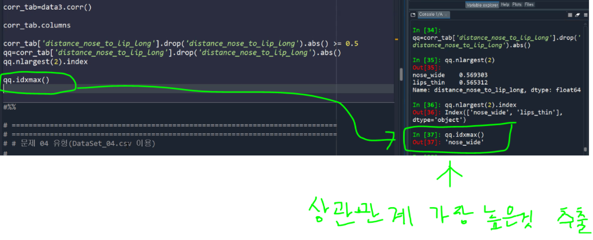

# 예제3

```python
# =============================================================================
# =============================================================================
# # 문제 03 유형(DataSet_03.csv 이용)
# 
# 구분자 : comma(“,”), 5,001 Rows, 8 Columns, UTF-8 인코딩
# 안경 체인을 운영하고 있는 한 회사에서 고객 사진을 바탕으로 안경의 사이즈를
# 맞춤 제작하는 비즈니스를 기획하고 있다. 우선 데이터만으로 고객의 성별을
# 파악하는 것이 가능할 지를 연구하고자 한다.
#
# 컬 럼 / 정 의 / Type
# long_hair / 머리카락 길이 (0 – 길지 않은 경우 / 1 – 긴
# 경우) / Integer
# forehead_width_cm / 이마의 폭 (cm) / Double
# forehead_height_cm / 이마의 높이 (cm) / Double
# nose_wide / 코의 넓이 (0 – 넓지 않은 경우 / 1 – 넓은 경우) / Integer
# nose_long / 코의 길이 (0 – 길지 않은 경우 / 1 – 긴 경우) / Integer
# lips_thin / 입술이 얇은지 여부 0 – 얇지 않은 경우 / 1 –
# 얇은 경우) / Integer
# distance_nose_to_lip_long / 인중의 길이(0 – 인중이 짧은 경우 / 1 – 인중이
# 긴 경우) / Integer
# gender / 성별 (Female / Male) / String
# =============================================================================
# =============================================================================
```


## 3번

```python
# =============================================================================
# 3.주어진 데이터를 사용하여 성별을 구분할 수 있는지 로지스틱 회귀분석을 적용하여
# 알아 보고자 한다. 
# - 데이터를 7대 3으로 나누어 각각 Train과 Test set로 사용한다. 이 때 seed는 123으로
# 한다.
# - 원 데이터에 있는 7개의 변수만 Feature로 사용하고 gender를 label로 사용한다.
# (forehead_ratio는 사용하지 않음)
# - 로지스틱 회귀분석 예측 함수와 Test dataset를 사용하여 예측을 수행하고 정확도를
# 평가한다. 이 때 임계값은 0.5를 사용한다. 
# - Male의 Precision 값을 소수점 둘째 자리까지 반올림하여 기술하시오. (답안 예시) 
# 0.12
# 
# 
# (참고) 
# from sklearn.linear_model import LogisticRegression
# from sklearn.model_selection import train_test_split
# from sklearn import metrics
# train_test_split 의 random_state = 123
# =============================================================================
```


**선형회귀**

> 설명은 강의자료 참고


**시그모이드 함수**

> 설명은 강의자료 참고


**Precision**
$$
Precision = \frac{TP}{TP+FP}
$$


+ 실제보다 작을수 있음.
+ 어떤 결과값이 리턴이 되는지 알아야됨.
+ 확률값이 주어졌다해서 무조건 사용하는건 아님.
+ 경계값은 고정값이 아니기에 조정이 가능함.


```python
from sklearn.linear_model import LogisticRegression
from sklearn.model_selection import train_test_split

# data3.columns
# 출력결과: ['long_hair', 'forehead_width_cm', 'forehead_height_cm', 'nose_wide',
       'nose_long', 'lips_thin', 'distance_nose_to_lip_long', 'gender',
       # 'forehead_ratio']


var_list = data3.columns.drop('gender') # gender를 label로 사용하기 위해 분리
train, test = train_test_split(data3, test_size=0.3, random_state=123) # 언패킹

logit = LogisticRegression().fit(train[var_list], train['gender'])

dir(logit)

logit.coef_
logit.intercept_

pred_class = logit.predict(test[var_list])
pred_pr = logit.predict_proba(test[var_list])

pred_class2 = np.where(pred_pr[:, 1] >= 0.8, 'Male', 'Female') # 0.8은 경계값(임계값)


# 성능평가
from sklearn.metrics import classification_report

print(classification_report(test['gender'], pred_class))


# 문제에서는 임계값을 0.5로 사용하라했으니 입계값만 바꿔서 'Precision'을 구하면된다.
```


**산술평균 외의 기타 다른 평균들**

+ 가중평균
+ 조화평균


# 예제4

```python
# =============================================================================
# =============================================================================
# # 문제 04 유형(DataSet_04.csv 이용)
#
#구분자 : comma(“,”), 6,718 Rows, 4 Columns, UTF-8 인코딩

# 한국인의 식생활 변화가 건강에 미치는 영향을 분석하기에 앞서 육류
# 소비량에 대한 분석을 하려고 한다. 확보한 데이터는 세계 각국의 1인당
# 육류 소비량 데이터로 아래와 같은 내용을 담고 있다.

# 컬 럼 / 정 의 / Type
# LOCATION / 국가명 / String
# SUBJECT / 육류 종류 (BEEF / PIG / POULTRY / SHEEP) / String
# TIME / 연도 (1990 ~ 2026) / Integer
# Value / 1인당 육류 소비량 (KG) / Double
# =============================================================================
# =============================================================================

# (참고)
# #1
# import pandas as pd
# import numpy as np
# #2
# from scipy.stats import ttest_rel
# #3
# from sklearn.linear_model import LinearRegression
```


```python
import pandas as pd
import numpy as np

data4=pd.read_csv('Dataset_04.csv')

data4.columns
#['LOCATION', 'SUBJECT', 'TIME', 'Value']
```


## 1번

```python
# =============================================================================
# 1.한국인의 1인당 육류 소비량이 해가 갈수록 증가하는 것으로 보여 상관분석을 통하여
# 확인하려고 한다. 
# - 데이터 파일로부터 한국 데이터만 추출한다. 한국은 KOR로 표기되어 있다.
# - 년도별 육류 소비량 합계를 구하여 TIME과 Value간의 상관분석을 수행하고
# 상관계수를 소수점 셋째 자리에서 반올림하여 소수점 둘째 자리까지만 기술하시오. 
# (답안 예시) 0.55
# =============================================================================
```


```python
q1 = data4[data4.LOCATION == 'KOR']
# 또는 data4[data4.LOCATION.isin(['KOR', 'JPN'])] 사용가능
# isin은 여러개 동시에 필터링 가능

tab = q1.groupby('TIME')['Value'].sum().reset_index(drop=False)

round(tab.corr()['Value']['TIME'],2)

# 답: 0.96
```


**공분산**
$$
공분산 = \frac{\sum(X_i-\bar{X}) (Y_i-\bar{Y})}{n}
$$


**상관계수**
$$
-1 < corr(X,Y) < 1
$$

+ 상관계수는 절대값을 취한값이 1이하를가짐.

+ 상관계수 절대값을 취한 값이 0.6 이상이면 상관관계가 높다고 판단함.


++ 데이터3 (예제3 데이터)의 상관분석

```python
#data3.corr(): 자동으로 문자열 변수들을 제외한 변수들로 상관관계 분석을 해준다.
corr_tab = data3.corr()

# 인중의 길이(distance_nose_to_lip_long)와 가장 상관관계가 높은것은?
corr_tab.columns

qq = corr_tab['distance_nose_to_lip_long'].drop('distance_nose_to_lip_long').abs()

# 상관관계가 가장높은 변수명 추출
qq.idxmax()

```


**`corr_tab` : 상관관계 분석 테이블**


**상관관계 테이블(`corr_tab`)의 컬럼 추출**


**`idxmax()`**




## 2번

```python
# =============================================================================
# 2. 한국 인근 국가 가운데 식생의 유사성이 상대적으로 높은 일본(JPN)과 비교하여, 연도별
# 소비량에 평균 차이가 있는지 분석하고자 한다.
# - 두 국가의 육류별 소비량을 연도기준으로 비교하는 대응표본 t 검정을 수행하시오.
# - 두 국가 간의 연도별 소비량 차이가 없는 것으로 판단할 수 있는 육류 종류를 모두
# 적으시오. (알파벳 순서) (답안 예시) BEEF, PIG, POULTRY, SHEEP
# =============================================================================
```


**육류 종류별로 한국, 일본 대응 테이블을 만들어야됨**

+ 결측치는 제외가 되도록 설계

+ H0: 두 국가 간의 연도별 소비량 차이가 없다
+ H1: 두 국가 간의 연도별 소비량 차이가 있다


```python
q2 = data4[data4.LOCATION.isin(['KOR', 'JPN'])]
q2.LOCATION.value_counts() # 결측치 존재 확인

sub_list = q2.SUBJECT.unique()
# 출력결과 : ['BEEF', 'PIG', 'POULTRY', 'SHEEP']


# 프로세스 : 육류 종류별로 필터링 -> 테이블(결측치 제외) -> 대응인 t 검정 -> 결과물을 누적 저장

from scipy.stats import ttest_rel # 대응인 t 검정용 함수

q2_out=[]
for i in sub_list:
    temp = q2[q2.SUBJECT == i]
	tab = pd.pivot_table(temp,
                    index='TIME', # 행방향
                    columns='LOCATION', # 열방향
                    values='Value' # 집계를 내야하는 변수
                    # aggfunc='mean'이 디폴트 파라미터
                     ).dropna() # 결측치 제거
    
    ttest_out = ttest_rel(tab['KOR'],tab['JPN'])
    pvalue = ttest_out.pvalue 
    q2_out.append([i, pvalue]) # 결과 저장

q2_out = pd.DataFrame(q2_out, columns=['sub', 'pvalue'])
q2_out[q2_out.pvalue >= 0.05]['sub']  # p-value 가 0.05보다 큰 육류종류만 추출

# 답: POULTRY
```


**`q2_out` 을 데이터프레임으로 변환**


**pvalue에서 답 추출**


## 3번

```python
# =============================================================================
# 3.(한국만 포함한 데이터에서) Time을 독립변수로, Value를 종속변수로 하여 육류
# 종류(SUBJECT) 별로 회귀분석을 수행하였을 때, 가장 높은 결정계수를 가진 모델의
# 학습오차 중 MAPE를 반올림하여 소수점 둘째 자리까지 기술하시오. (답안 예시) 21.12
# (MAPE : Mean Absolute Percentage Error, 평균 절대 백분율 오차)
# (MAPE = Σ ( | y - y ̂ | / y ) * 100/n 
# 
# =============================================================================
```


```python
q3 = data4[data4.LOCATION == 'KOR']

from sklearn.linear_model import LinearRegression

---------------------------------------------------------------------------
#%%
# for문에 넣기 전 test
# fit_intercept: 상수항 포함여부 옵션
# q3['TIME'] 괄호를 한개만 쓰면 배열 구조로 바꾸라는 경고가뜸.
lm = LinearRegression(fit_intercept=True).fit(q3[['TIME']], q3['Value'])  
pred = lm.predict(q3[['TIME']])

# score에 학습에 사용했던 데이터를 넣어준다.
r2 = lm.score(q3[['TIME']], q3['Value'])

#MAPE = Σ ( | y - y ̂ | / y ) * 100/n 
# q3['Value']: y값
# abs: 절대값
mape = (abs(q3['Value'] - pred)/ q3['Value']).sum() * 100 / len(q3)
-----------------------------------------------------------------------------


# for 문에 적용
q3_out=[]

for i in sub_list:
    temp = q3[q3.SUBJECT == i]
    
    lm = LinearRegression(fit_intercept=True).fit(temp[['TIME']], temp['Value'])  
    pred = lm.predict(temp[['TIME']])

    r2 = lm.score(temp[['TIME']], temp['Value'])
    
    mape = (abs(temp['Value'] - pred)/ temp['Value']).sum() * 100 / len(temp)
    q3_out.append([i, r2, mape])

    
q3_out = pd.DataFrame(q3_out, columns['sub', 'r2', 'mape'])
    
q3_out.iloc[q3_out.r2.argmax(), 2]
# 또는 q3_out.loc[q3_out.r2.idxmax(), 'mape']

# 답: 5.78
    
## [참고]
--육류 종류별로 회귀모델 재사용하기--
for i in sub_list:
    temp = q3[q3.SUBJECT == i]
    # 반복적으로 for 문을 돌때마다 육류 종류마다의 회귀모델이 만들어지게됨.
    globals()['lm_'+i] = LinearRegression(fit_intercept=True).fit(temp[['TIME']], temp['Value']) 

-- 각 육류 종류마다의 회귀모델 사용하기--
temp = q3[q3.SUBJECT == 'BEEF']
eval('lm_BEEF').predict(temp[['TIME']])


# [참고]_배열구조
q3['TIME'].ndim
q3['TIME'].shape

q3[['TIME']].ndim
q3[['TIME']].shape

q3['time'].values  # array 구조
q3['time'].values.reshape(-1, 1).shape

```


**선형회귀식**
$$
Value = b_0 + b_1 * 입력변수
$$


+ 대부분 상수항이 들어가는 모델로 채택을 한다.
+ 상수항은 넣어주는게 좋다. 결과는 비슷하게 나오는데 식 모양이 달라진다.


**데이터 구조**

+ `array` 구조로 변경하면 `array` 메소드를 사용할수있게됨. 
  + ex) `reshape` 메소드 등등


**결정계수, r2 **

+ E[y|x]: x가 주어졌을때 y에 대한 기댓값
+ R2 -> 데이터의 설명력이 높은 모델을 찾겠다는 의미


**`r2(결정계수)` 출력 결과**


**육류 종류마다의 회귀모델이 만들어진 모습**


**F 통계량**

> 강의자료 참고


$$
F 통계량 = \frac{MSR}{MSE}
$$


**비용함수**


**그레디언트 디센트 기법**

> 강의자료 참고

